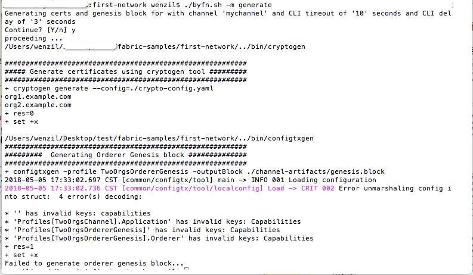

## Hyperledger Fabric开发环境搭建（MacOS系统）
#1、安装Homebrew：


```
/usr/bin/ruby -e "$(curl -fsSL https://raw.githubusercontent.com/Homebrew/install/master/install)"
```

#2、安装Go：

（1）安装命令：

```
brew install go
```
（2）检查安装版本（安装前可查看是否已安装）

```
wenzildeiMac:~ wenzil$ go version
go version go1.9.2 darwin/amd64
```

（3）配置环境变量

```
#GOPATH路径可能因人而异，注意先用"which go"检查一下path路径（如后面的一段）
export GOPATH=/usr/local/go
export GOBIN=$GOPATH/bin
export PATH=$PATH:$GOBIN
```
vim .bash_profile：进入vim，输入i切换为编辑模式，输入上面三段配置信息，然后按Esc键，输入:wq保存并退出编辑。
source ~/.bash_profile：作为执行命令，会立即生效，然后再检查一下Go

```
wenzildeiMac:go wenzil$ which go
/usr/local/go/bin/go
wenzildeiMac:~ wenzil$ cd ~
wenzildeiMac:~ wenzil$ vim .bash_profile 
wenzildeiMac:~ wenzil$ source ~/.bash_profile
wenzildeiMac:~ wenzil$ go version
go version go1.9.2 darwin/amd64
```

（4）检查Go的配置信息

```
wenzildeiMac:~ wenzil$ go env
GOARCH="amd64"
GOBIN=""
GOEXE=""
GOHOSTARCH="amd64"
GOHOSTOS="darwin"
GOOS="darwin"
GOPATH="/Users/wenzil/.rvm/gems/ruby-2.4.0/bin:/Users/wenzil/.rvm/gems/ruby-2.4.0@global/bin:/Users/wenzil/.rvm/rubies/ruby-2.4.0/bin:/usr/local/bin:/usr/bin:/bin:/usr/sbin:/sbin:/usr/local/go/bin:/Users/wenzil/.rvm/bin:/usr/local/go/bin"
GORACE=""
GOROOT="/usr/local/go"
GOTOOLDIR="/usr/local/go/pkg/tool/darwin_amd64"
GCCGO="gccgo"
CC="clang"
GOGCCFLAGS="-fPIC -m64 -pthread -fno-caret-diagnostics -Qunused-arguments -fmessage-length=0 -fdebug-prefix-map=/var/folders/rd/b67k290j5xbcfw59chnjm1qh0000gn/T/go-build472270299=/tmp/go-build -gno-record-gcc-switches -fno-common"
CXX="clang++"
CGO_ENABLED="1"
CGO_CFLAGS="-g -O2"
CGO_CPPFLAGS=""
CGO_CXXFLAGS="-g -O2"
CGO_FFLAGS="-g -O2"
CGO_LDFLAGS="-g -O2"
PKG_CONFIG="pkg-config"
```

#3、安装Docker：
Docker界面化软件方便操作和管理，下载地址如下
（点击页面的“Get Docker”按钮即可下载）

```
# 下载地址
https://store.docker.com/editions/community/docker-ce-desktop-mac
```


```
# 终端测试命令
wenzildeiMac:~ wenzil$ docker --version
Docker version 18.03.1-ce, build 9ee9f40
wenziliangdeiMac:~ wenzil$ docker-compose --version
docker-compose version 1.21.1, build 5a3f1a3
```

#4、安装nvm

```
curl -o- https://raw.githubusercontent.com/creationix/nvm/v0.33.7/install.sh | bash
```
安装成功后显示这么一段话（版本不同可能显示不同）：

```
=> If you wish to uninstall them at a later point (or re-install them under your
=> `nvm` Nodes), you can remove them from the system Node as follows:

     $ nvm use system
     $ npm uninstall -g a_module

=> Close and reopen your terminal to start using nvm or run the following to use it now:

export NVM_DIR="$HOME/.nvm"
[ -s "$NVM_DIR/nvm.sh" ] && \. "$NVM_DIR/nvm.sh"  # This loads nvm
[ -s "$NVM_DIR/bash_completion" ] && \. "$NVM_DIR/bash_completion"  # This loads nvm bash_completion
```

打开终端，编辑.bash_profile：

```
wenzildeiMac:~ wenzil$ cd ~
wenzildeiMac:~ wenzil$ vim .bash_profile 
```
在.bash_profile中直接复制添加上面返回打印的内容：

```
export NVM_DIR="$HOME/.nvm"
[ -s "$NVM_DIR/nvm.sh" ] && \. "$NVM_DIR/nvm.sh"  # This loads nvm
[ -s "$NVM_DIR/bash_completion" ] && \. "$NVM_DIR/bash_completion"  # This loads nvm bash_completion
```

然后执行如下命令，让配置立即生效：

```
source .bash_profile
```

#4、安装node指定版本

```
Node.js version 7.x is not supported at this time.
Node.js - version 6.9.x or greater
```
（意思说Fabric暂时不支持7.x，需要安装6.9.x或者更多版本）
官网对应的上面一句话地址：

```
http://hyperledger-fabric.readthedocs.io/en/v1.1.0-alpha/prereqs.html#node-js-runtime-and-npm
```

#5、下载Hyperledger的一个Demo源码

```
git clone https://github.com/hyperledger/fabric-samples
```

#6、下载特定平台的二进制文件（注意这里有坑，也可以跳过此步骤，先操作第7和第8步，再回来看下）
==**坑说明：有人直接让你下载某个平台某个版本的二进制文件，然后发现运行不了，无法进行下一步操作。**==

先打开Fabric的官网，会自动跳转到对应的版本：

```
http://hyperledger-fabric.readthedocs.io/
```
然后在左边的输入框，输入“fabric-samples”，右边会显示对应的结果，点击第一个

然后往下看，会看到框住的两部分，第一个就是说终端执行curl命令下载特定平台的二进制文件，然后可以打开第二个部分的那个网址了解最新的curl获取正确环境的其他信息


```
#第一部分的地址
curl -sSL https://goo.gl/6wtTN5 | bash -s 1.1.0
#第二部分的地址
https://github.com/hyperledger/fabric/blob/master/scripts/bootstrap.sh
```
如图所示，说明需要下载"1.1.0"版本
注意：直接下载会很慢，而且很容易失败（VPN模式下中断了好几次）
建议离线下载，网址：

```
https://nexus.hyperledger.org/content/repositories/releases/org/hyperledger/fabric/hyperledger-fabric/
```
打开网址，一定要找到对应操作系统对应版本号的文件（不然会失败），如图：

打开MacOS对应版本的文件夹，还有Windows、Linux其他系统，如图Windows系统可以打开该文件夹：

MacOS对应的文件夹，如图，点击下载压缩包文件：

下载成功后解压出来，是一个bin文件夹，然后复制该文件夹到fabric-samples根目录下，如图：


#7、设置Docker容器代理
设置Docker代理可提高镜像下载速度，否则很慢（慢到可能需要下载大半天甚至一天以上）。
点击"Docker"的"Preferences..."菜单，切换到"Daemon"菜单，在"Registry mirrors"中添加代理，地址如下：

```
# 试了该代理，速度快了很多
http://8890cb8b.m.daocloud.io
```
大牛推荐使用Docker官方提供的中国镜像加速（还没试过），网址：

```
https://www.docker-cn.com/registry-mirror
```
添加成功后，"Apply & Restart"按钮会变成可点击状态，点击进行配置自动重启Docker。


#8、安装Docker镜像前准备
先打开如下网址（这个可能需要翻墙）：

```
https://goo.gl/byy2Qj
```
在fabric-samples根目录下创建"init.sh"脚本文件（终端执行"vi init.sh"），将网站的内容复制到"init.sh"文件中。

注释掉下载平台二进制文件代码（注释echo和curl两行），然后保存并退出（按Esc，输入":wq"）

```
# echo "===> Downloading platform binaries"
# curl https://nexus.hyperledger.org/content/repositories/releases/org/hyperledger/fabric/hyperledger-fabric/${ARCH}-${VERSION}/hyperledger-fabric-${ARCH}-${VERSION}.tar.gz | tar xz
```
==**跳转第6步的注意看下：当时是按照6、7、8步骤操作的，现在想想应该可以不用注释上面这两行代码，然后省略第6步手动下载二进制文件，从让系统自动下载特定平台的二进制文件并自动解压，有机会可以试下，成功后应该会在fabric-samples根目录下生成bin文件夹。**==

设置"init.sh"文件最高权限777，执行"./init.sh"命令之前确保已经启动Docker。

```
vi init.sh
chmod 777 init.sh
./init.sh
```

#9、安装Docker镜像
执行了"./init.sh"命令之后，会下载很多镜像文件，目测十几G的样子，成功后如图：


#10、创建第一个区块链网络
（1）注意观察，在"first-network"目录下的"channel-artifacts"文件夹是空的。

（2）创建第一个区块链网络前，先关闭所有服务，执行命令:

```
./byfn.sh -m down
```
结果如图：


（3）创建区块链网络，执行如下命令：

```
./byfn.sh -m generat
```
 1.没有下载特定平台二进制文件的情况（被坑的结果）：


 2.重新下载了正确的特定平台二进制文件的情况，成功通过：


打开"channel-artifacts"目录，会发现多了四个文件


此时，Hyperledger Fabric开发环境基本搭建完毕。
接下的是创建和加入通道，安装和实例化链码，进行链码的调用等操作。
由于涉及内容过多，可以查看另外一篇文章“《Hyperledger Fabric运行体验（MacOS系统）》做参考”

