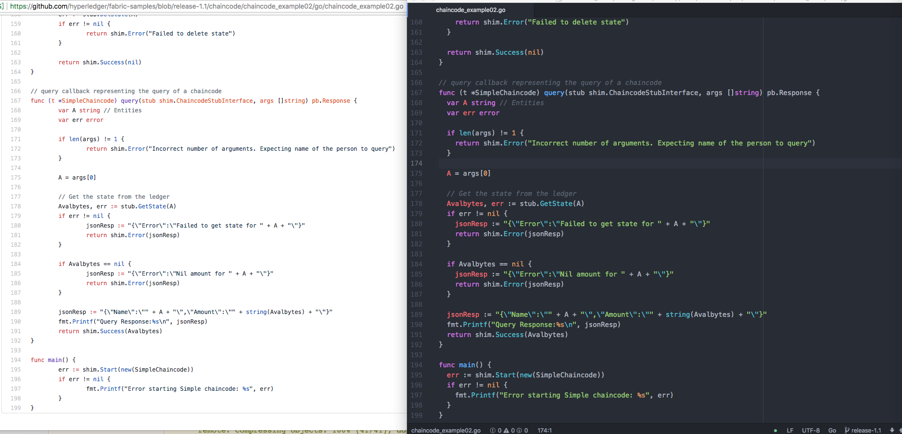

## Hyperledger Fabric运行体验（MacOS系统）
# 0、运行前提
==这里假设你已经安装了Homebrew、Go、Docker容器（并且已经下载了对应的images镜像）等环境（具体可以查看我另外一篇待发表的”Hyperleger Fabric环境搭建“参考）
（1）Homebrew安装命令:

```
/usr/bin/ruby -e "$(curl -fsSL https://raw.githubusercontent.com/Homebrew/install/master/install)"
```
（2）Go安装命令:

```
brew install go
```
（3）Docker界面化软件操作和管理，下载地址（点击页面的“Get Docker”按钮即可下载）:

```
# 下载地址
https://store.docker.com/editions/community/docker-ce-desktop-mac
# 终端测试命令
docker --version
docker-compose --version
```


运行Hyperledger Fabric需要设置比较多的初始化设置，官方的Demo工程已经生成了对应的配置文件，以下体验部署和调用过程：
#1、下载fabric-samples源码

```
git clone https://github.com/hyperledger/fabric-samples
```

```
wenzildeiMac:test wenzil$ git clone https://github.com/hyperledger/fabric-samples
Cloning into 'fabric-samples'...
remote: Counting objects: 1518, done.
remote: Compressing objects: 100% (41/41), done.
remote: Total 1518 (delta 20), reused 45 (delta 12), pack-reused 1464
Receiving objects: 100% (1518/1518), 564.97 KiB | 32.00 KiB/s, done.
Resolving deltas: 100% (703/703), done.
```

# 2、启动Docker容器：
（1）用cd命令进入到"fabric-samples/basic-network"目录，利用docker-compose启动Docker容器

```
docker-compose -f docker-compose.yml up -d
```

```
wenzildeiMac:basic-network carisok$ docker-compose -f docker-compose.yml up -d
Creating network "net_basic" with the default driver
Creating ca.example.com      ... done 
Creating cli                 ... done
Creating orderer.example.com ... done
Creating couchdb             ... done
Creating peer0.org1.example.com ... done
```
（2）可以利用如下命令查看已经启动的Docker容器

```
docker ps
```

```
wenzildeiMac:basic-network carisok$ docker ps
CONTAINER ID        IMAGE                        COMMAND                  CREATED             STATUS              PORTS                                            NAMES
6f2f13a6906b        hyperledger/fabric-peer      "peer node start"        9 seconds ago       Up 8 seconds        0.0.0.0:7051->7051/tcp, 0.0.0.0:7053->7053/tcp   peer0.org1.example.com
dbb264c6dd75        hyperledger/fabric-couchdb   "tini -- /docker-ent…"   11 seconds ago      Up 9 seconds        4369/tcp, 9100/tcp, 0.0.0.0:5984->5984/tcp       couchdb
178060c273f7        hyperledger/fabric-ca        "sh -c 'fabric-ca-se…"   11 seconds ago      Up 10 seconds       0.0.0.0:7054->7054/tcp                           ca.example.com
58881c674fbb        hyperledger/fabric-tools     "/bin/bash"              11 seconds ago      Up 11 seconds                                                        cli
062ca990755f        hyperledger/fabric-orderer   "orderer"                11 seconds ago      Up 11 seconds       0.0.0.0:7050->7050/tcp                           orderer.example.com
```

#3、切换到管理员用户，创建和加入通道：

（1）切换环境到管理员用户的MSP，进入Peer节点容器peer0.org1.example.com

```
docker exec -it -e "CORE_PEER_MSPCONFIGPATH=/etc/hyperledger/msp/users/Admin@org1.example.com/msp" peer0.org1.example.com bash
```

```
wenzildeiMac:basic-network carisok$ docker exec -it -e "CORE_PEER_MSPCONFIGPATH=/etc/hyperledger/msp/users/Admin@org1.example.com/msp" peer0.org1.example.com bash
root@6f2f13a6906b:/opt/gopath/src/github.com/hyperledger/fabric#
```
（2) 创建通道

```
peer channel create -o orderer.example.com:7050 -c mychannel -f /etc/hyperledger/configtx/channel.tx
```

```
root@6f2f13a6906b:/opt/gopath/src/github.com/hyperledger/fabric# peer channel create -o orderer.example.com:7050 -c mychannel -f /etc/hyperledger/configtx/channel.tx 
2018-05-08 05:40:37.509 UTC [msp] GetLocalMSP -> DEBU 001 Returning existing local MSP
2018-05-08 05:40:37.509 UTC [msp] GetDefaultSigningIdentity -> DEBU 002 Obtaining default signing identity
2018-05-08 05:40:37.512 UTC [channelCmd] InitCmdFactory -> INFO 003 Endorser and orderer connections initialized
2018-05-08 05:40:37.534 UTC [msp] GetLocalMSP -> DEBU 004 Returning existing local MSP
2018-05-08 05:40:37.534 UTC [msp] GetDefaultSigningIdentity -> DEBU 005 Obtaining default signing identity
2018-05-08 05:40:37.534 UTC [msp] GetLocalMSP -> DEBU 006 Returning existing local MSP
2018-05-08 05:40:37.534 UTC [msp] GetDefaultSigningIdentity -> DEBU 007 Obtaining default signing identity
2018-05-08 05:40:37.534 UTC [msp/identity] Sign -> DEBU 008 Sign: plaintext: 0A88060A074F7267314D535012FC052D...53616D706C65436F6E736F727469756D 
2018-05-08 05:40:37.534 UTC [msp/identity] Sign -> DEBU 009 Sign: digest: A462B649F175B93B20708D74C255506E79DAA47D96B43F1DD00B981FCFBFEF63 
2018-05-08 05:40:37.535 UTC [msp] GetLocalMSP -> DEBU 00a Returning existing local MSP
2018-05-08 05:40:37.535 UTC [msp] GetDefaultSigningIdentity -> DEBU 00b Obtaining default signing identity
2018-05-08 05:40:37.536 UTC [msp] GetLocalMSP -> DEBU 00c Returning existing local MSP
2018-05-08 05:40:37.536 UTC [msp] GetDefaultSigningIdentity -> DEBU 00d Obtaining default signing identity
2018-05-08 05:40:37.536 UTC [msp/identity] Sign -> DEBU 00e Sign: plaintext: 0ABF060A1508021A0608D5F0C4D70522...F7F20756FF8C1C7D32C2197CA185BFAF 
2018-05-08 05:40:37.536 UTC [msp/identity] Sign -> DEBU 00f Sign: digest: 85F8C092A9B0950D25439B524CC8B36DE0BB865967F31B418370C4254342637E 
2018-05-08 05:40:37.641 UTC [msp] GetLocalMSP -> DEBU 010 Returning existing local MSP
2018-05-08 05:40:37.642 UTC [msp] GetDefaultSigningIdentity -> DEBU 011 Obtaining default signing identity
2018-05-08 05:40:37.642 UTC [msp] GetLocalMSP -> DEBU 012 Returning existing local MSP
2018-05-08 05:40:37.642 UTC [msp] GetDefaultSigningIdentity -> DEBU 013 Obtaining default signing identity
2018-05-08 05:40:37.642 UTC [msp/identity] Sign -> DEBU 014 Sign: plaintext: 0ABF060A1508021A0608D5F0C4D70522...778004D484EE12080A021A0012021A00 
2018-05-08 05:40:37.642 UTC [msp/identity] Sign -> DEBU 015 Sign: digest: 56E81A6FD95EECA53FDA96E6D746AAD904CDB4757E8D431C5C38596FFF59EBE4 
2018-05-08 05:40:37.646 UTC [channelCmd] readBlock -> DEBU 016 Got status: &{NOT_FOUND}
2018-05-08 05:40:37.646 UTC [msp] GetLocalMSP -> DEBU 017 Returning existing local MSP
2018-05-08 05:40:37.646 UTC [msp] GetDefaultSigningIdentity -> DEBU 018 Obtaining default signing identity
2018-05-08 05:40:37.652 UTC [channelCmd] InitCmdFactory -> INFO 019 Endorser and orderer connections initialized
2018-05-08 05:40:37.853 UTC [msp] GetLocalMSP -> DEBU 01a Returning existing local MSP
2018-05-08 05:40:37.853 UTC [msp] GetDefaultSigningIdentity -> DEBU 01b Obtaining default signing identity
2018-05-08 05:40:37.853 UTC [msp] GetLocalMSP -> DEBU 01c Returning existing local MSP
2018-05-08 05:40:37.854 UTC [msp] GetDefaultSigningIdentity -> DEBU 01d Obtaining default signing identity
2018-05-08 05:40:37.854 UTC [msp/identity] Sign -> DEBU 01e Sign: plaintext: 0ABF060A1508021A0608D5F0C4D70522...58ECEBAF155112080A021A0012021A00 
2018-05-08 05:40:37.854 UTC [msp/identity] Sign -> DEBU 01f Sign: digest: FA7B43F85FF0D4C304BB308383DC54D2950578BEB064C473B43796E4F9F17899 
2018-05-08 05:40:37.858 UTC [channelCmd] readBlock -> DEBU 020 Received block: 0
2018-05-08 05:40:37.858 UTC [main] main -> INFO 021 Exiting.....
```
（3）加入通道

```
peer channel join -b mychannel.block
```

```
root@6f2f13a6906b:/opt/gopath/src/github.com/hyperledger/fabric# peer channel join -b mychannel.block
2018-05-08 05:41:39.827 UTC [msp] GetLocalMSP -> DEBU 001 Returning existing local MSP
2018-05-08 05:41:39.827 UTC [msp] GetDefaultSigningIdentity -> DEBU 002 Obtaining default signing identity
2018-05-08 05:41:39.830 UTC [channelCmd] InitCmdFactory -> INFO 003 Endorser and orderer connections initialized
2018-05-08 05:41:39.831 UTC [msp/identity] Sign -> DEBU 004 Sign: plaintext: 0A86070A5C08011A0C0893F1C4D70510...EC190FB0E3FF1A080A000A000A000A00 
2018-05-08 05:41:39.831 UTC [msp/identity] Sign -> DEBU 005 Sign: digest: 2AA40B075D666143259B537ECE13C75AFA716E1D15BA7A33803AFA9F4B4B524E 
2018-05-08 05:41:39.981 UTC [channelCmd] executeJoin -> INFO 006 Peer joined the channel!
2018-05-08 05:41:39.981 UTC [main] main -> INFO 007 Exiting.....
```

（4）退出Peer节点容器(peer0.org1.example.com)

```
exit
```

```
root@6f2f13a6906b:/opt/gopath/src/github.com/hyperledger/fabric# exit
exit
```

#4、进入cli容器

```
docker exec -it cli /bin/bash
```

```
carisokdeiMac:basic-network carisok$ docker exec -it cli /bin/bash
```
#5、安装链码
给Peer节点容器安装链码

```
peer chaincode install -n  mycc -v v0 -p github.com/chaincode_example02/go
```

```
root@58881c674fbb:/opt/gopath/src/github.com/hyperledger/fabric/peer# peer chaincode install -n  mycc -v v0 -p github.com/chaincode_example02/go
2018-05-08 05:42:40.937 UTC [msp] GetLocalMSP -> DEBU 001 Returning existing local MSP
2018-05-08 05:42:40.937 UTC [msp] GetDefaultSigningIdentity -> DEBU 002 Obtaining default signing identity
2018-05-08 05:42:40.938 UTC [chaincodeCmd] checkChaincodeCmdParams -> INFO 003 Using default escc
2018-05-08 05:42:40.938 UTC [chaincodeCmd] checkChaincodeCmdParams -> INFO 004 Using default vscc
2018-05-08 05:42:41.024 UTC [golang-platform] getCodeFromFS -> DEBU 005 getCodeFromFS github.com/chaincode_example02/go
2018-05-08 05:42:41.201 UTC [golang-platform] func1 -> DEBU 006 Discarding GOROOT package fmt
2018-05-08 05:42:41.201 UTC [golang-platform] func1 -> DEBU 007 Discarding provided package github.com/hyperledger/fabric/core/chaincode/shim
2018-05-08 05:42:41.201 UTC [golang-platform] func1 -> DEBU 008 Discarding provided package github.com/hyperledger/fabric/protos/peer
2018-05-08 05:42:41.202 UTC [golang-platform] func1 -> DEBU 009 Discarding GOROOT package strconv
2018-05-08 05:42:41.204 UTC [golang-platform] GetDeploymentPayload -> DEBU 00a done
2018-05-08 05:42:41.209 UTC [msp/identity] Sign -> DEBU 00b Sign: plaintext: 0A85070A5B08031A0B08D1F1C4D70510...FB8C7F070000FFFF02AE519E001C0000 
2018-05-08 05:42:41.209 UTC [msp/identity] Sign -> DEBU 00c Sign: digest: 5ADE48B900A481BC50F01A4561A7BAE4ED02A3268EBC51EA4344A38D660E6B0F 
2018-05-08 05:42:41.218 UTC [chaincodeCmd] install -> DEBU 00d Installed remotely response:<status:200 payload:"OK" > 
2018-05-08 05:42:41.218 UTC [main] main -> INFO 00e Exiting.....
```

#6、实例化链码

```
peer chaincode instantiate -o orderer.example.com:7050 -C mychannel -n mycc -v v0 -c '{"Args":["init","a","100","b","200"]}'
```
**a的初始值为100，b的初始值为200.**
**==出现了好几次TLS握手超时（"TLS handshake timeout"）问题，重新试过几次就好了==**
**==很多网络服务在国内被封了，特别是Google生态相关的服务，建议使用VPN（VPN也基本被封了，很难找到可以使用的，求推荐）==**

```
root@58881c674fbb:/opt/gopath/src/github.com/hyperledger/fabric/peer# peer chaincode instantiate -o orderer.example.com:7050 -C mychannel -n mycc -v v0 -c '{"Args":["init","a","100","b","200"]}'
2018-05-08 05:46:16.702 UTC [msp] GetLocalMSP -> DEBU 001 Returning existing local MSP
2018-05-08 05:46:16.702 UTC [msp] GetDefaultSigningIdentity -> DEBU 002 Obtaining default signing identity
2018-05-08 05:46:16.705 UTC [chaincodeCmd] checkChaincodeCmdParams -> INFO 003 Using default escc
2018-05-08 05:46:16.706 UTC [chaincodeCmd] checkChaincodeCmdParams -> INFO 004 Using default vscc
2018-05-08 05:46:16.707 UTC [msp/identity] Sign -> DEBU 005 Sign: plaintext: 0A91070A6708031A0C08A8F3C4D70510...30300A000A04657363630A0476736363 
2018-05-08 05:46:16.707 UTC [msp/identity] Sign -> DEBU 006 Sign: digest: DD341BB4FE9945205B9B55CB15D7C3B6A785B9396F4E7827057999622CE420F7 
Error: Error endorsing chaincode: rpc error: code = Unknown desc = Error starting container: error pulling image configuration: Get https://dseasb33srnrn.cloudfront.net/registry-v2/docker/registry/v2/blobs/sha256/bb/bbcbb9da2d837de73943b462f5217a5f6202a5e1cc57cc78cf1e8d9d6d4952cb/data?Expires=1525801591&Signature=Mx04gXyhUqyv4Si~gHwadobKzslnBKzNVGjXkB5H~H4D9TaVj7w9G7mLuY61oE9p0cTCU3Ov7jr0gpq9YwovJNqPcVRsyuMuhdEfmE-Jvrl2yhrJf6YIDsfl1KGuIqUiOxkKV50hNj45E~4NXM68hg516xZz2i6mCikGqaa9XZM_&Key-Pair-Id=APKAJECH5M7VWIS5YZ6Q: net/http: TLS handshake timeout
Usage:
  peer chaincode instantiate [flags]

Flags:
  -C, --channelID string   The channel on which this command should be executed (default "testchainid")
  -c, --ctor string        Constructor message for the chaincode in JSON format (default "{}")
  -E, --escc string        The name of the endorsement system chaincode to be used for this chaincode
  -l, --lang string        Language the chaincode is written in (default "golang")
  -n, --name string        Name of the chaincode
  -P, --policy string      The endorsement policy associated to this chaincode
  -v, --version string     Version of the chaincode specified in install/instantiate/upgrade commands
  -V, --vscc string        The name of the verification system chaincode to be used for this chaincode

Global Flags:
      --cafile string              Path to file containing PEM-encoded trusted certificate(s) for the ordering endpoint
      --logging-level string       Default logging level and overrides, see core.yaml for full syntax
  -o, --orderer string             Ordering service endpoint
      --test.coverprofile string   Done (default "coverage.cov")
      --tls                        Use TLS when communicating with the orderer endpoint
```

```
root@58881c674fbb:/opt/gopath/src/github.com/hyperledger/fabric/peer# peer chaincode instantiate -o orderer.example.com:7050 -C mychannel -n mycc -v v0 -c '{"Args":["init","a","100","b","200"]}'
2018-05-08 05:48:51.775 UTC [msp] GetLocalMSP -> DEBU 001 Returning existing local MSP
2018-05-08 05:48:51.775 UTC [msp] GetDefaultSigningIdentity -> DEBU 002 Obtaining default signing identity
2018-05-08 05:48:51.779 UTC [chaincodeCmd] checkChaincodeCmdParams -> INFO 003 Using default escc
2018-05-08 05:48:51.780 UTC [chaincodeCmd] checkChaincodeCmdParams -> INFO 004 Using default vscc
2018-05-08 05:48:51.781 UTC [msp/identity] Sign -> DEBU 005 Sign: plaintext: 0A91070A6708031A0C08C3F4C4D70510...30300A000A04657363630A0476736363 
2018-05-08 05:48:51.781 UTC [msp/identity] Sign -> DEBU 006 Sign: digest: 197B664DD613D1FCC94790FD89B4DBF2D3871EF31FC84FB2F5560E4C037769BA 
2018-05-08 05:49:10.910 UTC [msp/identity] Sign -> DEBU 007 Sign: plaintext: 0A91070A6708031A0C08C3F4C4D70510...B5653D8E17C6F74F274E6832D31C7739 
2018-05-08 05:49:10.910 UTC [msp/identity] Sign -> DEBU 008 Sign: digest: A80FA179B066CDD19BD1ABC9935D017914FC9DA607182060DC90DE2223A58A7B 
2018-05-08 05:49:10.926 UTC [main] main -> INFO 009 Exiting.....
```

#7、链码调用和查询
（1）链码实例化后，可以查询初始值

```
peer chaincode query -C mychannel -n mycc -v v0 -c '{"Args":["query","a"]}'
```

```
root@58881c674fbb:/opt/gopath/src/github.com/hyperledger/fabric/peer# peer chaincode query -C mychannel -n mycc -v v0 -c '{"Args":["query","a"]}'
2018-05-08 05:49:36.483 UTC [msp] GetLocalMSP -> DEBU 001 Returning existing local MSP
2018-05-08 05:49:36.483 UTC [msp] GetDefaultSigningIdentity -> DEBU 002 Obtaining default signing identity
2018-05-08 05:49:36.483 UTC [chaincodeCmd] checkChaincodeCmdParams -> INFO 003 Using default escc
2018-05-08 05:49:36.483 UTC [chaincodeCmd] checkChaincodeCmdParams -> INFO 004 Using default vscc
2018-05-08 05:49:36.483 UTC [msp/identity] Sign -> DEBU 005 Sign: plaintext: 0A91070A6708031A0C08F0F4C4D70510...6D7963631A0A0A0571756572790A0161 
2018-05-08 05:49:36.483 UTC [msp/identity] Sign -> DEBU 006 Sign: digest: 2EB7EBA3181FE95932D4217C1968A7413DAE6E9D22D5FD8204B64C82DDD0FFDC 
Query Result: 100
2018-05-08 05:49:36.572 UTC [main] main -> INFO 007 Exiting.....
```    

（2）从"a"转移10到"b"

```
peer chaincode invoke -C mychannel -n mycc -v v0 -c '{"Args":["invoke","a","b","10"]}'
```

```
####此处省略上百行结果输出####
2018-05-08 05:50:53.804 UTC [chaincodeCmd] chaincodeInvokeOrQuery -> INFO 0a6 Chaincode invoke successful. result: status:200 
2018-05-08 05:50:53.804 UTC [main] main -> INFO 0a7 Exiting.....
```
（3）再次查询“a”和"b"的值

```
peer chaincode query -C mychannel -n mycc -v v0 -c '{"Args":["query","a"]}'
peer chaincode query -C mychannel -n mycc -v v0 -c '{"Args":["query","b"]}'
```
==结果显示a为90，b为210.==

```
root@58881c674fbb:/opt/gopath/src/github.com/hyperledger/fabric/peer# peer chaincode query -C mychannel -n mycc -v v0 -c '{"Args":["query","a"]}'
2018-05-08 05:52:33.872 UTC [msp] GetLocalMSP -> DEBU 001 Returning existing local MSP
2018-05-08 05:52:33.872 UTC [msp] GetDefaultSigningIdentity -> DEBU 002 Obtaining default signing identity
2018-05-08 05:52:33.872 UTC [chaincodeCmd] checkChaincodeCmdParams -> INFO 003 Using default escc
2018-05-08 05:52:33.872 UTC [chaincodeCmd] checkChaincodeCmdParams -> INFO 004 Using default vscc
2018-05-08 05:52:33.874 UTC [msp/identity] Sign -> DEBU 005 Sign: plaintext: 0A91070A6708031A0C08A1F6C4D70510...6D7963631A0A0A0571756572790A0161 
2018-05-08 05:52:33.874 UTC [msp/identity] Sign -> DEBU 006 Sign: digest: B9872DD1C5F8577DBD22401AC64135AF83BA0A56226C94F0B3FF6EA9D1A9F1D5 
Query Result: 90
2018-05-08 05:52:33.907 UTC [main] main -> INFO 007 Exiting.....
root@58881c674fbb:/opt/gopath/src/github.com/hyperledger/fabric/peer# peer chaincode query -C mychannel -n mycc -v v0 -c '{"Args":["query","b"]}'
2018-05-08 05:53:05.120 UTC [msp] GetLocalMSP -> DEBU 001 Returning existing local MSP
2018-05-08 05:53:05.120 UTC [msp] GetDefaultSigningIdentity -> DEBU 002 Obtaining default signing identity
2018-05-08 05:53:05.120 UTC [chaincodeCmd] checkChaincodeCmdParams -> INFO 003 Using default escc
2018-05-08 05:53:05.120 UTC [chaincodeCmd] checkChaincodeCmdParams -> INFO 004 Using default vscc
2018-05-08 05:53:05.121 UTC [msp/identity] Sign -> DEBU 005 Sign: plaintext: 0A90070A6608031A0B08C1F6C4D70510...6D7963631A0A0A0571756572790A0162 
2018-05-08 05:53:05.121 UTC [msp/identity] Sign -> DEBU 006 Sign: digest: 749B62618BB4B9D7A70188BFCF3DBE050E9D4B635F040719EAA1476B58E85E4C 
Query Result: 210
2018-05-08 05:53:05.144 UTC [main] main -> INFO 007 Exiting.....
```

#8、代码查看和简单解读
打开github上面的代码

```
https://github.com/hyperledger/fabric-samples/blob/release-1.1/chaincode/chaincode_example02/go/chaincode_example02.go
```
和下载的“fabric-samples/chaincode/chaincode_example02/go"目录下的"chaincode_example02.go"文件对比，内容是一样的，说明是从"release-1.1"分支克隆下来的。


再来回顾下上面从"a"转移“b”的命令：

```
peer chaincode invoke -C mychannel -n mycc -v v0 -c '{"Args":["invoke","a","b","10"]}'
```
Args中的第一个参数用于说明调用哪个方法（"invoke"方法），第二个到后面的作为调用对应方法附带的参数，以下是invoke方法代码。
大概意思是：
1、变量A和B用于接收对应第二个和第三个参数的值（为字符串）
2、Aval和Bval作为变量A和B转为int类型的值
3、X是第四个参数（代码中已转为int类型）
4、执行“Aval = Aval - X，Bval = Bval + X”

于是计算过程为：
5、a的初始值为100，b的初始值为200
6、a = 100 - 10 = 90
7、b = 200 + 10 = 210

```
// Transaction makes payment of X units from A to B
func (t *SimpleChaincode) invoke(stub shim.ChaincodeStubInterface, args []string) pb.Response {
	var A, B string    // Entities
	var Aval, Bval int // Asset holdings
	var X int          // Transaction value
	var err error

	if len(args) != 3 {
		return shim.Error("Incorrect number of arguments. Expecting 3")
	}

	A = args[0]
	B = args[1]

	// Get the state from the ledger
	// TODO: will be nice to have a GetAllState call to ledger
	Avalbytes, err := stub.GetState(A)
	if err != nil {
		return shim.Error("Failed to get state")
	}
	if Avalbytes == nil {
		return shim.Error("Entity not found")
	}
	Aval, _ = strconv.Atoi(string(Avalbytes))

	Bvalbytes, err := stub.GetState(B)
	if err != nil {
		return shim.Error("Failed to get state")
	}
	if Bvalbytes == nil {
		return shim.Error("Entity not found")
	}
	Bval, _ = strconv.Atoi(string(Bvalbytes))

	// Perform the execution
	X, err = strconv.Atoi(args[2])
	if err != nil {
		return shim.Error("Invalid transaction amount, expecting a integer value")
	}
	Aval = Aval - X
	Bval = Bval + X
	fmt.Printf("Aval = %d, Bval = %d\n", Aval, Bval)

	// Write the state back to the ledger
	err = stub.PutState(A, []byte(strconv.Itoa(Aval)))
	if err != nil {
		return shim.Error(err.Error())
	}

	err = stub.PutState(B, []byte(strconv.Itoa(Bval)))
	if err != nil {
		return shim.Error(err.Error())
	}

	return shim.Success(nil)
}
```


