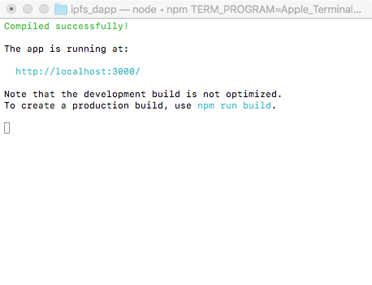

### IPFS开发简介与入门实践

#### 1、IPFS简介
* IPFS是什么

    星际文件系统IPFS（InterPlanetary File System）是一个面向全球的、点对点的分布式版本文件系统，目标是为了补充（甚至是取代）目前统治互联网的超文本传输协议（HTTP），将所有具有相同文件系统的计算设备连接在一起。原理用基于内容的地址替代基于域名的地址，也就是用户寻找的不是某个地址而是储存在某个地方的内容，不需要验证发送者的身份，而只需要验证内容的哈希，通过这样可以让网页的速度更快、更安全、更健壮、更持久。
    **以上内容来自巴比特官网介绍**
    
    IPFS是基于区块链技术的去中心化存储网络，实现了永久性存储。
    
* IPFS的火热

    Filecoin ICO是迄今为止涉及金额最大的ICO，仅一小时就募集了接近2亿美元，打破ICO记录，成为2017年最火爆的区块链项目。IPFS项目吸引了世界各地数字货币投资者和互联网从业者的密切关注，2018年比较值得期待的是IPFS主网的上线。然而就在前段时间，官方公布说上线时间延期到年底。
    注：Filecoin是IPFS激励层的加密数字货币（即代币），有点类似于以太坊平台上的以太币。
    
    IPFS官网：https://ipfs.io/
    
    Filecoin官网：https://filecoin.io/

* IPFS的应用案例
  GitHub有两款开源项目，且有对应网址，分别是音乐播放器和视频播放器。
    * IPFS音乐播放器
    

    
        IPFS音乐播放器网址：https://diffuse.sh/
        GitHub地址：https://github.com/icidasset/diffuse

    
    * IPFS视频在线播放器
    


    


    号称是国内第一个IPFS应用
    IPFS视频在线播放器网址：http://www.ipfs.guide/
    GitHub地址：https://github.com/download13/ipfstube
    可用于测试的电影视频Hash（这里只列举两部部）：
    神秘巨星：QmWBbKvLhVnkryKG6F5YdkcnoVahwD7Qi3CeJeZgM6Tq68
    盗梦空间：QmQATmpxXvSiQgt9c9idz9k3S3gQnh7wYj4DbdMQ9VGyLh

#### 2、IPFS的安装

既然IPFS这么牛，有必要了解一下IPFS的开发，先从环境搭建开始。

* IPFS Desktop

    当然，可以直接安装IPFS节点桌面管理软件来体验一下。该软件可以方便地运行和管理自己的节点，查看IPFS节点资源信息，支持二次开发。该项目是Node.js编写的，已开源。
    

    
    GitHub地址：
    https://github.com/ipfs-shipyard/ipfs-desktop

* Go-IPFS

    进入ipfs的官网，找到并切换到"Install"页面，点击"Download IPFS for your platform"，会跳转到如下网址（需要翻墙）：
    https://dist.ipfs.io/#go-ipfs

    


    如果打不开，可以试着去Github查看安装方法
GitHub地址：https://github.com/ipfs/go-ipfs

    将网页下载好的文件解压出来，下载的是"go-ipfs_v0.4.13_darwin-amd64.tar.gz"，解压出来的是go-ipfs文件夹，
    然后打开终端，进入到go-ipfs文件夹根目录，复制ipfs文件到系统的bin目录，然后可以通过"ipfs version"来检查，操作如下：
    
    ```
    wenzildeiMac:go-ipfs wenzil$ pwd
    /Users/wenzil/Desktop/study/go-ipfs
    wenzildeiMac:go-ipfs wenzil$ ls
    LICENSE		README.md	build-log	install.sh	ipfs
    wenzildeiMac:go-ipfs wenzil$ cp ipfs /usr/local/bin/ipfs
    wenzildeiMac:go-ipfs wenzil$ ipfs version
    ipfs version 0.4.13
    ```


#### 3、IPFS节点的创建、查看和启动
**以下是安装官网的Go-IPFS步骤下实验的**

* 创建节点

    然后进入到当前用户的根目录，并"ipfs init"命令创建节点，可以用"open ./"打开创建节点生成的".ipfs"目录。
    
    ```
    wenzildeiMac:go-ipfs wenzil$ cd ~/
    wenzildeiMac:~ wenzil$ pwd
    /Users/wenzil
    wenzildeiMac:~ wenzil$ ipfs init
    initializing IPFS node at /Users/wenzil/.ipfs
    generating 2048-bit RSA keypair...done
    peer identity: QmWH4xmGBznY9CJ4SjxpxWqGwMwrFtPdjgeweLCfJxW8j9
    to get started, enter:
    
    	ipfs cat /ipfs/QmS4ustL54uo8FzR9455qaxZwuMiUhyvMcX9Ba8nUH4uVv/readme
    
    wenzildeiMac:~ wenzil$ cd .ipfs
    wenzildeiMac:.ipfs wenzil$ open ./
    ```
    


* 查看节点
    
    ```
    wenzildeiMac:.ipfs wenzil$ ipfs id
    {
    	"ID": "QmWH4xmGBznY9CJ4SjxpxWqGwMwrFtPdjgeweLCfJxW8j9",
    	"PublicKey": "CAASpgIwggEiMA0GCSqGSIb3DQEBAQUAA4IBDwAwggEKAoIBAQCt98O5zNptBtmSF6xYdOHAMunQsXE9rAmgqBXVPLJk+AoaBjNiAipB+sTXKwaj8stp9c3iuSzz10+dyYI38bq4TPDCsHnQ3PjKSgZwEaT0M6pJhGqJcSbLY57CjQOEwgFe+tw3b4hcoDvvNJMG0dZZg1r9xnfevBz0DNewlj2vtviSTQL6r/ZXlD04GsytxTSQ2pzMJTG3QmYyokeZ37DT7Vwa+IJjDCiDJC5BlZ204zunZBx3tqWUn2Hr2NtEX+4YDdX4SBHa0ZDNqZmzLRe5YlAXjVI0ONHs+BVsC1v1L5we52iSYCSgVHoxRP/pa9EZdHMvgs9QeAa5jO90yxgTAgMBAAE=",
    	"Addresses": null,
    	"AgentVersion": "go-ipfs/0.4.13/",
    	"ProtocolVersion": "ipfs/0.1.0"
    }
    ```

* 修改IPFS默认存储空间

    存储节点默认存储大小为10G，如果你想修改存储空间，可以修改config配置文件，找到StorageMax并修改

    ```
    wenzildeiMac:~ wenzil$ export EDITOR=/usr/bin/vim
    wenzildeiMac:~ wenzil$ ipfs config edit  
    ```   
    
    如图:
    


       
    
* 启动和同步节点服务器

    执行"ipfs daemon"命令，可以同步节点数据到IPFS网络。

    ```
    wenzildeiMac:.ipfs wenzil$ ipfs daemon
    Initializing daemon...
    Adjusting current ulimit to 2048...
    Successfully raised file descriptor limit to 2048.
    Swarm listening on /ip4/127.0.0.1/tcp/4001
    Swarm listening on /ip4/192.168.1.100/tcp/4001
    Swarm listening on /ip6/::1/tcp/4001
    Swarm listening on /p2p-circuit/ipfs/QmWH4xmGBznY9CJ4SjxpxWqGwMwrFtPdjgeweLCfJxW8j9
    Swarm announcing /ip4/100.64.9.179/tcp/55898
    Swarm announcing /ip4/127.0.0.1/tcp/4001
    Swarm announcing /ip4/192.168.1.100/tcp/4001
    Swarm announcing /ip6/::1/tcp/4001
    API server listening on /ip4/127.0.0.1/tcp/5001
    Gateway (readonly) server listening on /ip4/127.0.0.1/tcp/8080
    Daemon is ready
    ```


#### 4、IPFS运行体验
    
* IPFS查看ReadMe

    可以回去查看执行"ipfs init"命令的时候，返回的内容。打开一个新的终端，操作如下：

    ```
    wenzildeiMac:~ wenzil$ ipfs cat /ipfs/QmYwAPJzv5CZsnA625s3Xf2nemtYgPpHdWEz79ojWnPbdG/readme
    Hello and Welcome to IPFS!
    
    ██╗██████╗ ███████╗███████╗
    ██║██╔══██╗██╔════╝██╔════╝
    ██║██████╔╝█████╗  ███████╗
    ██║██╔═══╝ ██╔══╝  ╚════██║
    ██║██║     ██║     ███████║
    ╚═╝╚═╝     ╚═╝     ╚══════╝
    
    If you're seeing this, you have successfully installed
    IPFS and are now interfacing with the ipfs merkledag!
    
     -------------------------------------------------------
    | Warning:                                              |
    |   This is alpha software. Use at your own discretion! |
    |   Much is missing or lacking polish. There are bugs.  |
    |   Not yet secure. Read the security notes for more.   |
     -------------------------------------------------------
    
    Check out some of the other files in this directory:
    
      ./about
      ./help
      ./quick-start     <-- usage examples
      ./readme          <-- this file
      ./security-notes
    ```
* Web管理界面：

    IPFS节点服务器启动后，可以用浏览器访问：http://localhost:5001/webui
有本地配置、节点连接、本地节点文件等信息，如图：
    


#### 5、设置跨域资源共享
当我们在前端通过js接口操作ipfs时，会遇到跨域资源访问问题，可以在终端执行以下配置来解决：

```
ipfs config --json API.HTTPHeaders.Access-Control-Allow-Methods '["PUT","GET", "POST", "OPTIONS"]'
ipfs config --json API.HTTPHeaders.Access-Control-Allow-Origin '["*"]'
ipfs config --json API.HTTPHeaders.Access-Control-Allow-Credentials '["true"]'
ipfs config --json API.HTTPHeaders.Access-Control-Allow-Headers '["Authorization"]'
ipfs config --json API.HTTPHeaders.Access-Control-Expose-Headers '["Location"]'
```

#### 6、IPFS的基本操作
> ##### 6.1 添加单个文件到IPFS节点

* 新建文件

    ```
    wenzildeiMac:ifps_test wenzil$ vi test.txt
    wenzildeiMac:ifps_test wenzil$ cat test.txt 
    IPFS测试文件
    ```

* 添加文件到IPFS节点

    ```
    wenzildeiMac:ifps_test wenzil$ ipfs add test.txt 
    added QmSVKEwPBTzw5QLzGUE8oN8J1r4cadMeieSw4Co1ozm2Ab test.txt
    ```
    添加文件到IPFS节点后，返回了文件的哈希值

* 查看IPFS节点的文件

    ```
    wenzildeiMac:ifps_test wenzil$ ipfs cat QmSVKEwPBTzw5QLzGUE8oN8J1r4cadMeieSw4Co1ozm2Ab
    IPFS测试文件
    ```
    注意：此时的文件只是添加到了本地的IPFS节点，读取的是本地数据，可以通过如下网址查看。
http://localhost:8080/ipfs/QmSVKEwPBTzw5QLzGUE8oN8J1r4cadMeieSw4Co1ozm2Ab
    
    通过"ipfs daemon"命令启动节点服务器，会将本地节点文件同步到外网，同步成功后，这时就可以访问如下网址来查看（如果访问失败，试着翻墙看看）。
    https://ipfs.io/ipfs/QmSVKEwPBTzw5QLzGUE8oN8J1r4cadMeieSw4Co1ozm2Ab
    


    
    如果访问成功的话，说明已经存储到IPFS网络中。目前IPFS网络暂未加入代币Filecoin机制，所以存储读取文件免费，速度也比较慢。    
    

* 下载IPFS节点的文件

    ```
    wenzildeiMac:ifps_test wenzil$ ipfs get QmSVKEwPBTzw5QLzGUE8oN8J1r4cadMeieSw4Co1ozm2Ab
    Saving file(s) to QmSVKEwPBTzw5QLzGUE8oN8J1r4cadMeieSw4Co1ozm2Ab
     25 B / 25 B [========================================================] 100.00% 0s
    ```
    
    查看当前目录，发现多了一个"QmSV..."的文件"
    
    


> ##### 6.2 创建文件夹存储文件

* ipfs命令新建文件夹
    
    ```
    wenzildeiMac:ipfs_test wenzil$ pwd
    /Users/wenzil/Desktop/study/ipfs_test
    wenzildeiMac:ipfs_test wenzil$ ipfs files mkdir /wenzil
    wenzildeiMac:ipfs_test wenzil$ ipfs files cp /ipfs/QmSVKEwPBTzw5QLzGUE8oN8J1r4cadMeieSw4Co1ozm2Ab /wenzil/test.txt
    wenzildeiMac:ipfs_test wenzil$ ipfs files ls
    test
    wenzil
    wenzildeiMac:ipfs_test wenzil$ ipfs files ls /
    test
    wenzil
    wenzildeiMac:ipfs_test wenzil$ ipfs files rm -rf /test
    wenzildeiMac:ipfs_test wenzil$ ipfs files ls
    wenzil
    wenzildeiMac:ipfs_test wenzil$ ipfs files ls /wenzil
    test.txt
    wenzildeiMac:ipfs_test wenzil$ ipfs files read /wenzil/test.txt
    IPFS测试文件
    ```
    
    注："ipfs files rm -rf /文件夹名"可以删除文件夹。
    
> ##### 6.3 IPFS上传文件夹

* ipfs命令添加文件夹
    先在本地创建一个文件夹和对应文件，如图：
    
    

    然后通过"ipfs add -r 文件夹"命令添加整个文件夹
    
    ```
    wenzildeiMac:ipfs_folder wenzil$ pwd
    /Users/wenzil/Desktop/study/ipfs_folder
    wenzildeiMac:ipfs_folder wenzil$ ls
    portrait.jpeg	readme.txt
    wenzildeiMac:ipfs_folder wenzil$ cd ..
wenzildeiMac:study wenzil$ pwd
/Users/wenzil/Desktop/study
    wenzildeiMac:study wenzil$ ipfs add -r ipfs_folder/
added QmbHptfJfyuGAZxstFYgAVfz33cytR1seTD3ZabBSDd899 ipfs_folder/portrait.jpeg
added QmPEWgwQEHD6qxm5cUivTEZ252T123DvQ5L6HyUDgViQvT ipfs_folder/readme.txt
added QmdSd3xxKcwuMugyLCiLWzaeZKDkuM39R2tzyF3kBFDoaj ipfs_folder
wenzildeiMac:study wenzil$ 
    ```

* 查看文件夹的文件内容
    
    ```
    wenzildeiMac:study wenzil$ ipfs cat QmPEWgwQEHD6qxm5cUivTEZ252T123DvQ5L6HyUDgViQvT
    我是区块链开发小白，请大家多多赐教，谢谢。
    欢迎阅读我的区块链系列文章，简书地址：
    https://www.jianshu.com/u/5f809ab3698c
    wenzildeiMac:study wenzil$ ipfs cat /ipfs/QmPEWgwQEHD6qxm5cUivTEZ252T123DvQ5L6HyUDgViQvT
我是区块链开发小白，请大家多多赐教，谢谢。
欢迎阅读我的区块链系列文章，简书地址：
https://www.jianshu.com/u/5f809ab3698c
    wenzildeiMac:study wenzil$ ipfs cat /ipfs/QmdSd3xxKcwuMugyLCiLWzaeZKDkuM39R2tzyF3kBFDoaj/readme.txt
我是区块链开发小白，请大家多多赐教，谢谢。
欢迎阅读我的区块链系列文章，简书地址：
https://www.jianshu.com/u/5f809ab3698c
    ```

* 查看IPFS对应文件夹
    访问文件夹对应的IPFS地址：
https://ipfs.io/ipfs/QmdSd3xxKcwuMugyLCiLWzaeZKDkuM39R2tzyF3kBFDoaj

    第一次访问的时候，需要同步数据到IPFS网络，等待时间有点久，慢到让你以为同步失败了。
    

    访问文件夹对应的文件，如看到图片文件，访问ipfs官网：
https://ipfs.io/ipfs/QmdSd3xxKcwuMugyLCiLWzaeZKDkuM39R2tzyF3kBFDoaj/portrait.jpeg
    

    或者通过文件的Hash来访问，如访问txt文件的地址：
    https://ipfs.io/ipfs/QmPEWgwQEHD6qxm5cUivTEZ252T123DvQ5L6HyUDgViQvT
    

> ##### 6.4 添加简单网页到IPFS节点
    
    
 * 网页效果和项目结构

    实现一个简单的实时显示系统当前时间的网页，效果如图：
    


    工程结构如图:
    

    实现代码比较简单，这里就不贴代码了。
    
* ipfs命令添加文件夹

    ```
    wenzildeiMac:study wenzil$ ipfs add -r ipfs_html
    added QmTj49dgFgFhfNRTUYyUSzk3puj7vvDoVsAynFrL7GAj1d ipfs_html/index.html
    added QmeHFBSyN9KqeZWKyKTWKYzDRU192YWDRjf6sLWFWhwk2z ipfs_html/styles.css
    added QmWkEfgL2pjo7n8b9YBCv4qwE77YWePkSscxiHQfPpwpkp ipfs_html/time.js
    added QmeG6LKmEfF5s62cySE9ZnU8EifmU46CQTixipfzsZspDD ipfs_html
    ```

    记得要开启IPFS节点服务器进行数据的同步，可以使用"ipfs daemon"命令在新的终端窗口打开运行。
    
    ```
    wenzildeiMac:~ wenzil$ ipfs daemon
    Initializing daemon...
    Adjusting current ulimit to 2048...
    Successfully raised file descriptor limit to 2048.
    Swarm listening on /ip4/127.0.0.1/tcp/4001
    Swarm listening on /ip4/192.168.6.31/tcp/4001
    Swarm listening on /ip6/::1/tcp/4001
    Swarm listening on /p2p-circuit/ipfs/QmcXWJqPjCgr1wrReWu2zUT41E5FrrXp2uyyNZRr7jXXrz
    Swarm announcing /ip4/127.0.0.1/tcp/4001
    Swarm announcing /ip4/192.168.6.31/tcp/4001
    Swarm announcing /ip6/::1/tcp/4001
    API server listening on /ip4/127.0.0.1/tcp/5001
    Gateway (readonly) server listening on /ip4/127.0.0.1/tcp/8082
    Daemon is ready
    ```

* 访问ipfs对应文件
    
    浏览器访问ipfs网关： 
    https://ipfs.io/ipfs/QmeG6LKmEfF5s62cySE9ZnU8EifmU46CQTixipfzsZspDD/
    


> ##### 6.5 IPNS绑定节点名
  
  * IPNS绑定节点操作
  
    每次修改文件内容后，文件的哈希值就会发生变化。对于网站而言，发布后可能还需要做修改，这时需要IPNS绑定节点名。每次更新网站内容后，重新publish一次更新发布到IPNS即可。
刚才的html根目录的哈希值是QmeG6LKmEfF5s62cySE9ZnU8EifmU46CQTixipfzsZspDD，操作如下：
    
    
    ```
    wenzildeiMac:study wenzil$ ipfs name publish QmeG6LKmEfF5s62cySE9ZnU8EifmU46CQTixipfzsZspDD
    Published to QmcXWJqPjCgr1wrReWu2zUT41E5FrrXp2uyyNZRr7jXXrz: /ipfs/QmeG6LKmEfF5s62cySE9ZnU8EifmU46CQTixipfzsZspDD
    ```

* 查看当前节点
    
    ```
    wenzildeiMac:study wenzil$ ipfs id
    {
    	"ID": "QmcXWJqPjCgr1wrReWu2zUT41E5FrrXp2uyyNZRr7jXXrz",
    	"PublicKey": "CAASpg......",
    	"Addresses": [
    		"/ip4/127.0.0.1/tcp/4001/ipfs/QmcXWJqPjCgr1wrReWu2zUT41E5FrrXp2uyyNZRr7jXXrz",
    		"/ip4/192.168.6.31/tcp/4001/ipfs/QmcXWJqPjCgr1wrReWu2zUT41E5FrrXp2uyyNZRr7jXXrz",
    		"/ip6/::1/tcp/4001/ipfs/QmcXWJqPjCgr1wrReWu2zUT41E5FrrXp2uyyNZRr7jXXrz",
    		"/ip4/14.xxx.xxx.xxx/tcp/4001/ipfs/QmcXWJqPjCgr1wrReWu2zUT41E5FrrXp2uyyNZRr7jXXrz",
    		"/ip4/61.xxx.xxx.xxx/tcp/20472/ipfs/QmcXWJqPjCgr1wrReWu2zUT41E5FrrXp2uyyNZRr7jXXrz"
    	],
    	"AgentVersion": "go-ipfs/0.4.13/",
    	"ProtocolVersion": "ipfs/0.1.0"
    }    
    ```
    
    发现"ID"和上面"Published to"返回的节点一直，都是"QmcXWJqPjCgr1wrReWu2zUT41E5FrrXp2uyyNZRr7jXXrz"

* 验证节点   
    
    命令为："ipfs name resolve 节点ID“
    
    ```
    wenzildeiMac:study wenzil$ ipfs name resolve QmcXWJqPjCgr1wrReWu2zUT41E5FrrXp2uyyNZRr7jXXrz
    /ipfs/QmeG6LKmEfF5s62cySE9ZnU8EifmU46CQTixipfzsZspDD
    ```

* 访问IPNS对应文件 

    浏览器访问ipfs网关：
    https://ipfs.io/ipns/QmcXWJqPjCgr1wrReWu2zUT41E5FrrXp2uyyNZRr7jXXrz/
    


    
#### 7、IPFS与以太坊DApp开发实战

* IPFS与以太坊DApp结合的好处

    在以太坊平台上，往区块链写入数据需要花费以太币，调用智能合约执行每一行代码的时候，都需要一定量的gas交易费。区块链存储大数据成本很高，而且不合理。
    可以先将文件存储到IPFS，然后得到文件的Hash存储到以太坊区块链中。读取文件的时候，从以太坊区块链中获取文件的Hash，再通过Hash来读取IPFS网络上的文件。
    使用官方提供的ipfs-api，可以很方便地在代码中操作节点将数据上传到IPFS，或者通过Hash从IPFS读取数据。
    Truffle框架提供了快速搭建包含以太坊智能合约的React项目，可以通过"truffle unbox react"创建工程，然后安装ipfs-api依赖库。于是，可以在前端方便地调用IPFS的接口来读取、上传文件。
    
    truffle unbox react官网：
    
    ```
    http://truffleframework.com/boxes/react
    ```

* IPFS与DApp开发实战
  话不多说，开始进入实战开发。
  
   > ##### 7.1 安装Truffle unbox react
   
   新建一个空目录"ipfs_dapp"，然后执行安装命令
    
    命令：
    
    ```
    truffle unbox react
    ```
    
    ```
    wenzildeiMac:ipfs_dapp wenzil$ pwd
    /Users/wenzil/Desktop/study/ipfs_dapp
    wenzildeiMac:ipfs_dapp wenzil$ truffle unbox react
    Downloading...
    Unpacking...
    Setting up...
    Unbox successful. Sweet!
    
    Commands:
    
      Compile:              truffle compile
      Migrate:              truffle migrate
      Test contracts:       truffle test
      Test dapp:            npm test
      Run dev server:       npm run start
      Build for production: npm run build
    ```  

    > ##### 7.2 安装ipfs-api
    
    命令：
    
    ```
    npm install --save ipfs-api
    ```

    ```
    wenzildeiMac:ipfs_dapp wenzil$ npm install --save ipfs-api
    npm WARN deprecated bignumber.js@6.0.0: Custom ALPHABET bug fixed in v7.0.2
    react-box@0.1.0 /Users/wenzil/Desktop/study/ipfs_dapp
    ├─┬ ipfs-api@22.0.0 
    │ ├── async@2.6.1 
    │ ├── big.js@5.1.1 
    │ ├─┬ bs58@4.0.1 
    │ │ └── base-x@3.0.4 
    # ...... 省略N多行输出
    ```
    
    > ##### 7.3 修改智能合约代码
    
    修改contracts目录中的"SimpleStorage.sol"，修改后完整代码：
    
    ```
    pragma solidity ^0.4.18;
    
    contract SimpleStorage {
      // 用于存储图片的哈希值
      string storedData;
    
      function set(string x) public {
        storedData = x;
      }
    
      function get() public view returns (string) {
        return storedData;
      }
    }    
    ```

    修改"Migrations.sol"
    
    ```
    function Migrations() public {
     owner = msg.sender;
    }
    修改为：
    constructor() public {
        owner = msg.sender;
    }
    ```

 > ##### 7.4 编译智能合约
    
    命令：
    
    ```
    truffle compile
    ```
    
    ```
    wenzildeiMac:ipfs_dapp wenzil$ truffle compile
    Compiling ./contracts/Migrations.sol...
    Compiling ./contracts/SimpleStorage.sol...
    Writing artifacts to ./build/contracts
    ```
    
    > ##### 7.5 部署智能合约
    进入remix-ide，复制SimpleStorage.sol代码，然后切换到"Run"菜单，选择"Injected Web3"进行智能合约的部署
    
     


    
    
然后复制智能合约地址，App.js文件中会用到合约地址为:"0xb177d6cf6916f128c9931e610c63208d9c5a40f3"

 > ##### 7.5 修改App.js文件


```
import React, {Component} from 'react'
import SimpleStorageContract from '../build/contracts/SimpleStorage.json'
import getWeb3 from './utils/getWeb3'

import './css/oswald.css'
import './css/open-sans.css'
import './css/pure-min.css'
import './App.css'

const ipfsAPI = require('ipfs-api');
const ipfs = ipfsAPI({
  host: 'localhost',
  port: '5001',
  protocol: 'http'
});

const contract = require('truffle-contract')
const simpleStorage = contract(SimpleStorageContract)
let account;

// Declaring this for later so we can chain functions on SimpleStorage.
let contractInstance;

let saveImageToIPFS = (reader) => {
  return new Promise(function(resolve, reject) {
    const buffer = Buffer.from(reader.result);
    ipfs.add(buffer).then((response) => {
      console.log(response)
      resolve(response[0].hash);
    }).catch((err) => {
      console.error(err)
      reject(err);
    })
  })
}

class App extends Component {
  constructor(props) {
    super(props)

    this.state = {
      blockChainHash: null,
      web3: null,
      address: null,
      imageHash: null,
      isSuccess: false
    }
  }

  componentWillMount() {

    ipfs.swarm.peers(function(err, res) {
      if (err) {
        console.error(err);
      } else {
        // var numPeers = res.Peers === null ? 0 : res.Peers.length;
        // console.log("IPFS - connected to " + numPeers + " peers");
        console.log(res);
      }
    });

    getWeb3.then(results => {
      this.setState({web3: results.web3})

      // Instantiate contract once web3 provided.
      this.instantiateContract()
    }).catch(() => {
      console.log('Error finding web3.')
    })
  }

  instantiateContract = () => {

    simpleStorage.setProvider(this.state.web3.currentProvider);
    this.state.web3.eth.getAccounts((error, accounts) => {
      account = accounts[0];
      simpleStorage.at('0xb177d6cf6916f128c9931e610c63208d9c5a40f3').then((contract) => {
        console.log(contract.address);
        contractInstance = contract;
        this.setState({address: contractInstance.address});
        return;
      });
    })

  }
  render() {
    return (
      <div className="App">
        <div style={{marginTop:10}}>智能合约地址：</div>
        <div>{this.state.address}</div>
        <div style={{marginTop:10}}>上传图片到IPFS：</div>
        <div>
          <label id="file">选择图片</label>
          <input type="file" ref="file" id="file" name="file" multiple="multiple"/>
        </div>
        <button style={{marginTop:10}} onClick={() => {
            var file = this.refs.file.files[0];
            var reader = new FileReader();
            reader.readAsArrayBuffer(file)
            reader.onloadend = function(e) {
              console.log(reader);
              saveImageToIPFS(reader).then((hash) => {
                console.log(hash);
                this.setState({imageHash: hash})
              });

          }.bind(this);
      }}>开始上传</button>

      <div style={{marginTop:10}}>图片哈希值：{this.state.imageHash}</div>
      <button onClick={() => {
           contractInstance.set(this.state.imageHash, {from: account}).then(() => {
              console.log('图片的hash已经写入到区块链！');
              this.setState({isSuccess: true});
          })
      }}>图片哈希写入区块链</button>

      {
        this.state.isSuccess
          ? <div style={{marginTop:10}}>
              <div>图片哈希成功写入区块链！</div>
              <button onClick={() => {
                  contractInstance.get({from: account}).then((data) => {
                    console.log(data);
                    this.setState({blockChainHash: data});
                  })
                }}>从区块链读取图片哈希</button>
            </div>
          : <div/>
      }
      {
        this.state.blockChainHash
          ? <div style={{marginTop:10}}>
              <div>从区块链读取到的哈希值：{this.state.blockChainHash}</div>
            </div>
          : <div/>
      }
      {
        this.state.blockChainHash
          ? <div style={{marginTop:10}}>
              <div>访问本地文件：</div>
              <div>{"http://localhost:8082/ipfs/" + this.state.imageHash}</div>
              <div>访问IPFS网关：</div>
              <div>{"https://ipfs.io/ipfs/" + this.state.imageHash}</div>
              
            </div>
          : 
      }

    </div>);
  }
}

export default App
```
    
 > ##### 7.6 新建终端，执行"npm start"命令，结果如图:
 


会自动打开网页，然后上传图片，点击"图片写入区块链"


最终效果如图:


访问IPFS网关：
https://ipfs.io/ipfs/QmbHptfJfyuGAZxstFYgAVfz33cytR1seTD3ZabBSDd899

发现图片已经成功写入IPFS


备注：本地IPFS文件端口默认为8080，我的端口冲突了，系统自动修改为8082。

搞定，收工。

