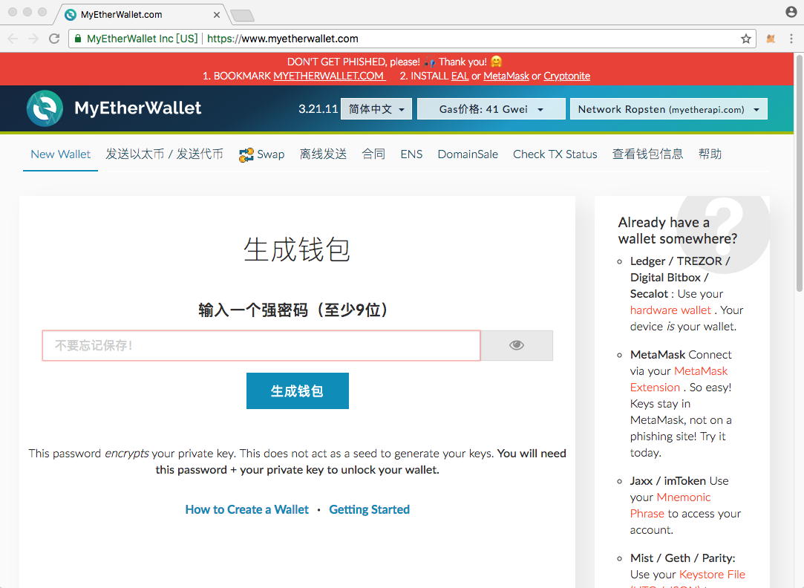

### 以太坊开发简介（上）
#### 1、以太坊简介
* 以太坊的诞生
2013年末，以太坊创始人维塔利克.布特林（Vitalik Buterin）发布了以太坊白皮书，描述了以太坊协议的技术设计和基本原理以及智能合约的结构，在全球的密码学货币社区陆续召集到一批认可以太坊理念的开发者并启动了项目。2014年1月，在美国佛罗里达州迈阿密举行的北美比特币会议上第一次公布了以太坊项目，核心开发团队成为世界级的密码学货币团队。

* 创始人简介
 维塔利克.布特林，出生于1994年，俄罗斯黑客出身，币圈人称“小神童”、“V神”。维塔利克.布特林曾击败Facebook创始人马克·扎克伯格，获得2014年IT软件类世界技术奖。
 

* 以太坊与区块链
以太坊（Ethereum），也被称为区块链2.0，是一个全新的区块链应用平台。借鉴了比特币区块链的技术，支持图灵完备的脚本语言（以太币的脚本系统是图灵不完备的），允许开发者通过智能合约在平台上建立和使用基于区块链的去中心化应用DApp。
简单地讲，以太坊 = 区块链 + 智能合约。
  
    图灵完备：一切可计算的问题都能计算，这样的虚拟机或者编程语言就叫图灵完备的。

    [以太坊白皮书（中文翻译版）](https://ethfans.org/posts/ethereum-whitepaper)

#### 2、以太币钱包的使用
在开发以太坊智能合约的过程中，需要使用到相关的以太币（分主网和测试网以太币），通过钱包来部署智能合约或者转账等操作。目前有很多以太坊钱包，如Mist、Parity、MyEtherWallet和MetaMask等。

* Mist
Mist钱包是以太坊官方提供的去中心化应用，通过Mist可以很方便地连接私有网络，开发调试和部署智能合约。Mist是一个全节点钱包（需要同步全部的以太坊区块信息的钱包），打开钱包后，电脑会自动同步以太坊区块信息，主网同步数据需要大半天时间。

    下载地址：
    https://ethereum.org/

    

* Parity
  Parity钱包是以太坊前CTO（Gavin Wood）组建的团队开发的，功能强大。安装成功后，同步区块大约需要10分钟左右。
  

  下载地址：
  https://www.parity.io/
  
* MyEtherWallet
    是一个轻钱包，无需下载，使用方便，直接在网页上完成所有操作。创建账号时会生成私钥，用户要保管好自己的私钥。
    
    

    交易时需要上传私钥，使用时要认准官方网址，远离钓鱼网站 
    网址：https://www.myetherwallet.com
    

* MetaMask
   官网地址；
   https://metamask.io/
   点击网页的“GET CHROME EXTENSION”链接（需要翻墙），在Chrome浏览器安装MetaMask插件，可以导入MyEtherWallet创建账号时生成的私钥来导入账号，已安装使用的效果如图：
   

#### 3、如何获取以太币
以太币分为主网和测试网络，可以通过挖矿或者直接购买获取一台白。在开发调试过程中，一般选择切换到测试网络，测试网络又分为Ropsten、Kovan和Rinkeby。相对于主网络，测试网络使用人数少，节点少，也容易被篡改，容易获取以太币。以MetaMask为例，以下讲解如何获取测试以太币

* Ropsten
  这个最简单，可以通过MetaMask上面的"Buy"按钮跳转到购买以太币的确认页面，然后点击"Ropsten Test Faucet"按钮跳转到一个网址，点击"request 1 ehter from faucet"获取以太币，成功的话会得到一个以太币，如图（比刚才多了一个以太币）。
  

  
* Kovan
  通过如下网址获取：
  https://gitter.im/kovan-testnet/faucet
  登录GitHub，然后拷贝自己的以太坊地址，直接发送出去。每次请求（发另外一个地址也属于再次请求）能获取到5个以太币（"Scott Bigelow"是个机器人，一般情况下回复速度还可以，有一次好几个小时才回复），然后隔72个小时才能再次请求。
  

* Rinkeby
可以参考知乎上的来操作：
[玩转以太坊(Ethereum)的测试网络（编辑于 2017-09-08）](https://zhuanlan.zhihu.com/p/29010231)
但是，按照作者描述的用Github来操作，结果都失败了，评论中有人说已经不支持Github了，可以用Google+来获取。

发现内容还是有点多，主要是时间不早了，暂时分为上下两篇，或者后续再补充其他的内容吧

