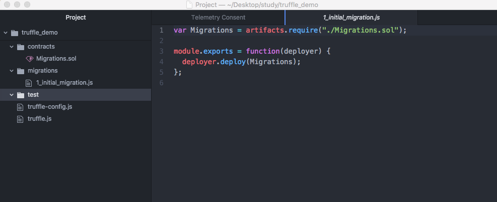

### 以太坊开发简介（下）
上篇介绍了以太坊的诞生、以太币钱包的使用以及如何获取以太币，这篇文档中分别对了编写和部署智能合约、Dapp开发框架Truffle的使用等两个方面作简单介绍，其他的后续再作补充

以太坊官网地址：

```
https://ethereum.org/
```

#### 1、开发工具介绍
智能合约是以太坊中重要的概念，是指运行在区块链上的模块化、可重用、自动执行的脚本。在以太坊平台上的智能合约，使用Solidity语言编写（类似于JavaScript的语言）。Solidity是一种智能合约高级语言，运行在Ethereum虚拟机（EVM）之上。官网地址：

 ```
 http://solidity.readthedocs.io/en
 ```
 [【文档翻译系列】Solidity语言](http://www.tryblockchain.org/)

正所谓，“工欲善其事必先利其器”，在开发中选择一款好用的开发工具是非常重要的。


* Atom编辑器

Atom编辑器支持Windows、Mac、Linux，轻量级且界面漂亮，安装插件方便，支持语法高亮，因此推荐使用，当然也可以使用VSCode、Subline等其他编辑器。

官网下载地址：https://atom.io/

以MacOS为例，打开Atom，然后打开"Atom"-->"Preferences..."，点击"Install"菜单，在右边的输入框中输入对应的插件名，点击"Install"进行安装。
安装两个插件：autocomplete-solidity、language-ethereum


安装插件后效果如图：


* Remix在线编辑器

Remix 是一个开源的 Solidity 智能合约开发环境，提供基本的编译、部署至本地或测试网络、执行合约等功能，另外还有调试功能。有个Bug，就是输入中文显示会有问题。
网址：http://remix.ethereum.org/
    
也可以在GitHub下载离线版
    
```
https://github.com/ethereum/remix-ide
```


如图，左上角可以编辑Solidity代码，左下角显示部署智能合约时的生成的相关区块信息，编写代码时会自动编译，黄色的显示一些警告信息（暂时可以不用理会），绿色表示编译成功。可以点击"Run"切换到部署智能合约的界面，"Debugger"可以进行调试等等。


Person.sol 源码：

```
pragma solidity ^0.4.23;
/*
   pragma:版本声明
   solidity：开发语言
   0.4.23：当前合约的版本 ，向上兼容，(0.4.23~0.49)均可编译
*/

// contract 关键字声明，与面向对象编程的类相似
contract Person {
    uint age; // 状态变量，默认为internal
    string internal name = "人类";  // internal表示只能在当前合约或者合约的子类中使用
    string public job = "IT";    // public声明的属性，会自动生成同名的get函数
    string private phone = "13512345678"; // private表示只能在当前合约使用
    Address workAddress;

    struct Address {  // 声明结构体
      string country;
      string province;
      string city;
    }

    // 构造函数，用constructor修饰，初始化时会自动被调用
    constructor() public {
        age = 0;
        workAddress = Address('中国','汉东省','京州');
    }

    // set方法，方法默认为public，能够被外部合约访问
    function setPhone(string p) public {
        phone = p;
    }
    // get方法
    function getPhone() constant public returns (string) {
        return phone;
    }

    // msg.sender 返回操作当前合约的账户地址
    function getCurrentAddress() view public returns (address) {
        return msg.sender;
    }

    function test() pure public returns (string) {
      return "test";
    }

    function getWorkCity() constant public returns (string) {
        return workAddress.city;
    }

    // 普通函数
    function kill() public{
        // 析构函数，调用时销毁当前合约
        selfdestruct(msg.sender);
    }
}

// is表示继承
contract Student is Person {
    // 函数默认声明为public，不写public编译会出现警告
    constructor() public {
        age = 18;
        name = "学生仔";
    }

    function sayHello() pure public returns (string) {
        // 不能直接用字符串拼接，会报错
        // return (name + age);
        return "hello";
    }
}

```

#### 2、DApp开发框架Truffle的使用
DApp：去中心化应用 
DApp官网地址：

```
https://dapp.readthedocs.io/en/latest/
```


Truffle是目前比较流行的Solidity智能合约开发框架，功能十分强大，可以帮助开发者快速地开发一个DApp。

Truffle官网地址：

```
http://truffleframework.com/
```

* 1.安装Truffle：


```
$ npm install -g truffle
```

* 2.创建Truffle项目：

```
wenzildeiMac:truffle_demo wenzil$ truffle init
Downloading...
Unpacking...
Setting up...
Unbox successful. Sweet!

Commands:

  Compile:        truffle compile
  Migrate:        truffle migrate
  Test contracts: truffle test
```

* 3.启动Truffle内置客户端：

```
wenzildeiMac:truffle_demo wenzil$ truffle develop
Truffle Develop started at http://127.0.0.1:9545/

Accounts:
(0) 0x627306090abab3a6e1400e9345bc60c78a8bef57
(1) 0xf17f52151ebef6c7334fad080c5704d77216b732
(2) 0xc5fdf4076b8f3a5357c5e395ab970b5b54098fef
(3) 0x821aea9a577a9b44299b9c15c88cf3087f3b5544
(4) 0x0d1d4e623d10f9fba5db95830f7d3839406c6af2
(5) 0x2932b7a2355d6fecc4b5c0b6bd44cc31df247a2e
(6) 0x2191ef87e392377ec08e7c08eb105ef5448eced5
(7) 0x0f4f2ac550a1b4e2280d04c21cea7ebd822934b5
(8) 0x6330a553fc93768f612722bb8c2ec78ac90b3bbc
(9) 0x5aeda56215b167893e80b4fe645ba6d5bab767de

Private Keys:
(0) c87509a1c067bbde78beb793e6fa76530b6382a4c0241e5e4a9ec0a0f44dc0d3
(1) ae6ae8e5ccbfb04590405997ee2d52d2b330726137b875053c36d94e974d162f
(2) 0dbbe8e4ae425a6d2687f1a7e3ba17bc98c673636790f1b8ad91193c05875ef1
(3) c88b703fb08cbea894b6aeff5a544fb92e78a18e19814cd85da83b71f772aa6c
(4) 388c684f0ba1ef5017716adb5d21a053ea8e90277d0868337519f97bede61418
(5) 659cbb0e2411a44db63778987b1e22153c086a95eb6b18bdf89de078917abc63
(6) 82d052c865f5763aad42add438569276c00d3d88a2d062d36b2bae914d58b8c8
(7) aa3680d5d48a8283413f7a108367c7299ca73f553735860a87b08f39395618b7
(8) 0f62d96d6675f32685bbdb8ac13cda7c23436f63efbb9d07700d8669ff12b7c4
(9) 8d5366123cb560bb606379f90a0bfd4769eecc0557f1b362dcae9012b548b1e5

Mnemonic: candy maple cake sugar pudding cream honey rich smooth crumble sweet treat

⚠️  Important ⚠️  : This mnemonic was created for you by Truffle. It is not secure.
Ensure you do not use it on production blockchains, or else you risk losing funds.
```

注意看："http://127.0.0.1:9545/"
为当前服务的IP和端口，会自动生成10个有100个以太币的测试账号，都带有对应的私钥“Private Keys”，这个可以用来导入恢复账号（如在MetaMask设置对应的IP和端口号，然后导入钱包）

* 4.Web3.js api的使用：

```
truffle(develop)> web3.eth.accounts;
[ '0x627306090abab3a6e1400e9345bc60c78a8bef57',
  '0xf17f52151ebef6c7334fad080c5704d77216b732',
  '0xc5fdf4076b8f3a5357c5e395ab970b5b54098fef',
  '0x821aea9a577a9b44299b9c15c88cf3087f3b5544',
  '0x0d1d4e623d10f9fba5db95830f7d3839406c6af2',
  '0x2932b7a2355d6fecc4b5c0b6bd44cc31df247a2e',
  '0x2191ef87e392377ec08e7c08eb105ef5448eced5',
  '0x0f4f2ac550a1b4e2280d04c21cea7ebd822934b5',
  '0x6330a553fc93768f612722bb8c2ec78ac90b3bbc',
  '0x5aeda56215b167893e80b4fe645ba6d5bab767de' ]
truffle(develop)> web3.eth.coinbase;
'0x627306090abab3a6e1400e9345bc60c78a8bef57'
truffle(develop)> web3.eth.accounts[0];
'0x627306090abab3a6e1400e9345bc60c78a8bef57'
truffle(develop)> web3.fromWei(2000000000000000000,'ether')
'2'
truffle(develop)> web3.toWei(2,'ether');
'2000000000000000000'
truffle(develop)> web3.eth.getBalance(web3.eth.coinbase)
{ [String: '100000000000000000000'] s: 1, e: 20, c: [ 1000000 ] }
truffle(develop)> web3.eth.getBalance(web3.eth.coinbase).toNumber();
100000000000000000000
truffle(develop)> web3.fromWei(web3.eth.getBalance(web3.eth.coinbase).toNumber(), 'ether'); 
'100'
truffle(develop)> var coinbaseAmount = web3.eth.getBalance(web3.eth.coinbase);
undefined
truffle(develop)> web3.fromWei(coinbaseAmount.toNumber(), 'ether')
'100'
truffle(develop)> web3.net.peerCount;
0
truffle(develop)> web3.net.listening
true
truffle(develop)> web3.eth.defaultBlock
'latest'
truffle(develop)> web3.eth.getBalance("0x5aeda56215b167893e80b4fe645ba6d5bab767de")
{ [String: '100000000000000000000'] s: 1, e: 20, c: [ 1000000 ] }
```


* 5.Web3.js 演示转账：

    挖矿的账号(coinbase)向另外一个账号转20个以太币

    ```
    truffle(develop)> var account1 = web3.eth.coinbase;
    undefined
    truffle(develop)> var account2 = web3.eth.accounts[2];
    undefined
    truffle(develop)> web3.fromWei(web3.eth.getBalance(account1).toNumber(), 'ether')
    '79.99999999999998'
    truffle(develop)> web3.fromWei(web3.eth.getBalance(account2).toNumber(), 'ether')
    '100'
    truffle(develop)>  web3.eth.sendTransaction({from:account1, to:account2, value:sendEtherNumber});
    '0x6aae64d0cdce1695730083ee0ffe8a82d777f1cf2278499f6e030ead71a47702'
    truffle(develop)> web3.fromWei(web3.eth.getBalance(account1).toNumber(), 'ether')
    '59.99999999999996'
    truffle(develop)> web3.fromWei(web3.eth.getBalance(account2).toNumber(), 'ether')
    '120'
    truffle(develop)> 
    ```
    
* 6.添加智能合约和部署文件：

    在Atom打开项目，如图
    

    文件说明：
    contrcts/：智能合约代码文件夹
    migrations/：部署智能合约的脚本
    tests/：存放用于测试的智能合约文件
    truffle.js：Truffle默认的配置文件

    将之前创建的Person.sol文件复制到contrcts文件夹，然后在migrations文件夹新建"2_initial_person.js"文件（名字随意，要以数字开头带下划线），输入如下内容（主要copy已存在的js文件内容作修改）：

    ```
    var Person = artifacts.require("./Person.sol");
    
    module.exports = function(deployer) {
      deployer.deploy(Person);
    };
    ```

* 7、编译智能合约源文件
    执行"compile"命令，发现出现了一个警告：

    ```
    truffle(develop)> compile
    Compiling ./contracts/Migrations.sol...
    Compiling ./contracts/Person.sol...
    
    Compilation warnings encountered:
    
    /Users/wenzil/Desktop/study/truffle_demo/contracts/Migrations.sol:11:3: Warning: Defining constructors as functions with the same name as the contract is deprecated. Use "constructor(...) { ... }" instead.
      function Migrations() public {
      ^ (Relevant source part starts here and spans across multiple lines).
    
    Writing artifacts to ./build/contracts
    ```
    
    ```
    Migrations.sol文件里面的
    function Migrations() public {
        owner = msg.sender;
    }
    修改为
    constructor() public {
        owner = msg.sender;
    }
    ```

* 8、重新编译
  删除当前项目工程中的"build"目录，可以直接在Atom中直接删除，也可以通过在终端中进入项目根目录，然后执行如下命令：
  
  ```
    wenzildeiMac:truffle_demo wenzil$ cd /Users/wenzil/Desktop/study/truffle_demo 
    wenzildeiMac:truffle_demo wenzil$ rm -rf build/
    wenzildeiMac:truffle_demo wenzil$ ls
    contracts		test			truffle.js
    migrations		truffle-config.js
  ```
  
  发现"build/"目录已删除，然后再次编译，警告消失了
  
  ```
  truffle(develop)> compile
  Compiling ./contracts/Migrations.sol...
  Compiling ./contracts/Person.sol...
  Writing artifacts to ./build/contracts
  ```


* 9、部署合约
执行"migrate"命令，如下：

    ```
    truffle(develop)> migrate
    Using network 'develop'.
    
    Running migration: 1_initial_migration.js
      Deploying Migrations...
      ... 0x25dd44b419f19c62d0c8538bcb4078738e3a957db9520a2cb9d272cf6b245763
      Migrations: 0x345ca3e014aaf5dca488057592ee47305d9b3e10
    Saving successful migration to network...
      ... 0xcc6faa4193f59d7da676c7557e13271f41a8a97ca0ce171911aaf0355b92f11d
    Saving artifacts...
    Running migration: 2_initial_person.js
      Deploying Person...
      ... 0x204a52f8cb115cf6e222d4f367fd5e94127846e1eb8534c24e2f2dc974b3107e
      Person: 0x8f0483125fcb9aaaefa9209d8e9d7b9c8b9fb90f
    Saving successful migration to network...
      ... 0x61826f086be719997aa398ef8cbc8ba8d3fb9cdd04f7486fb0f2e0c7565d2b59
    Saving artifacts...
    ```


* 10、调用并查看合约：

    ```
    truffle(develop)> var contract;
  undefined
  truffle(develop)> contract = Person.deployed().then(instance => contract = instance);
    ...//后面打印了一大堆信息，已省略
    
    truffle(develop)> contract.getWorkCity();
  '京州'
    truffle(develop)> contract.job();
  'IT'
    truffle(develop)> contract.getPhone();
  '13512345678'
    truffle(develop)> contract.test();
  'test'
    ```
    
    搞定，收工。。。
    


