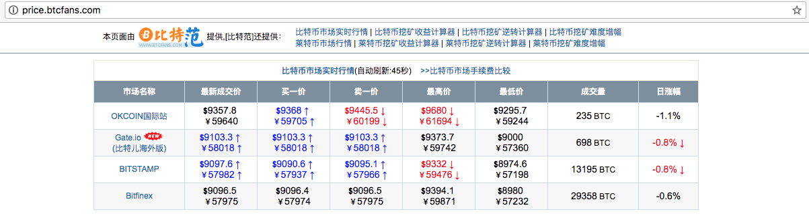
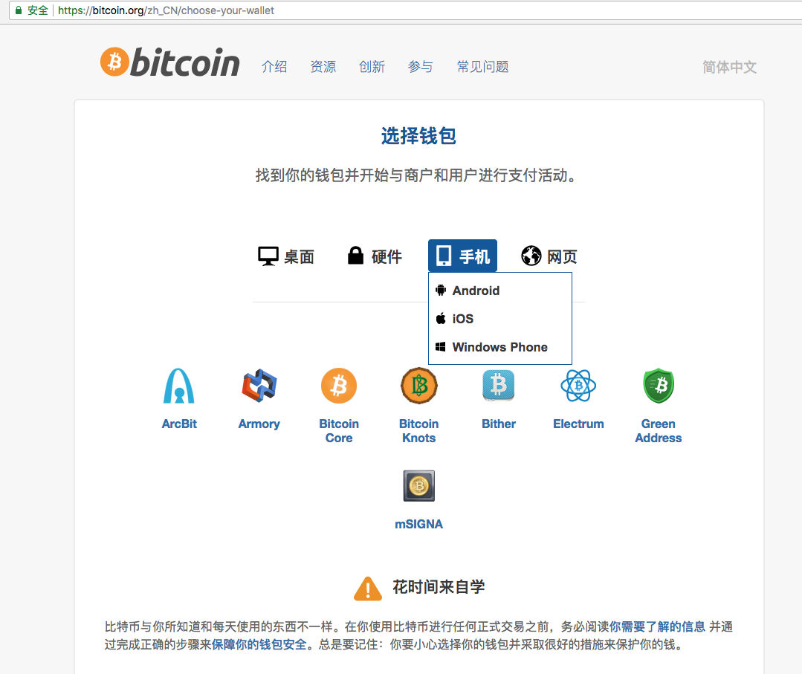
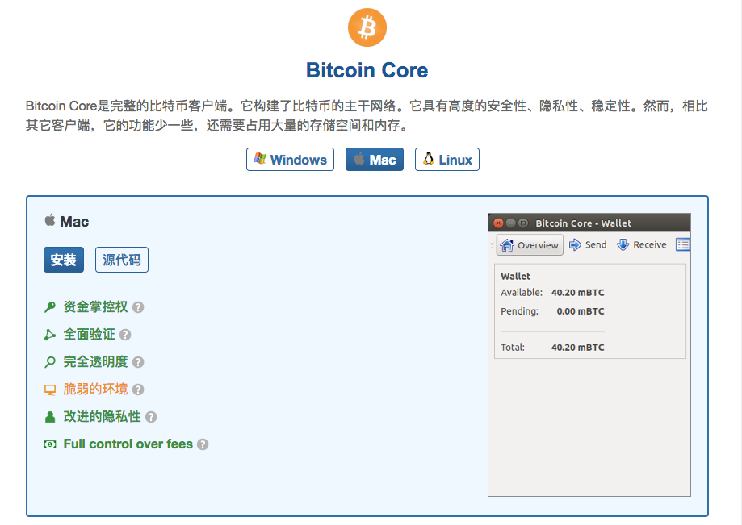
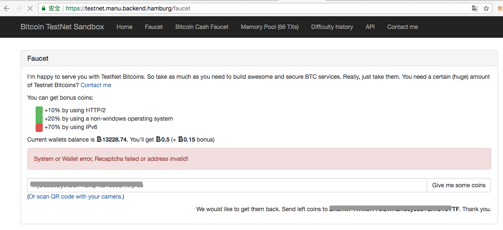
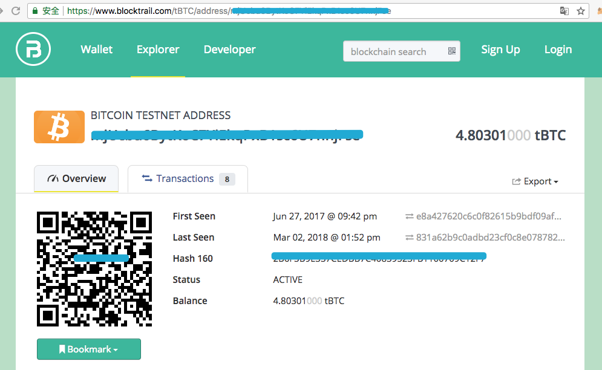
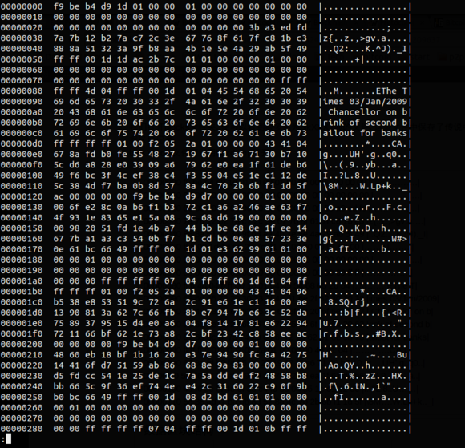
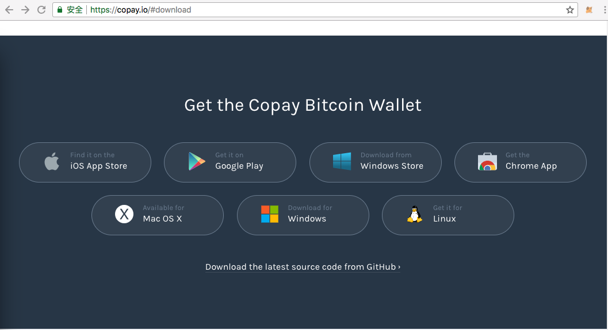
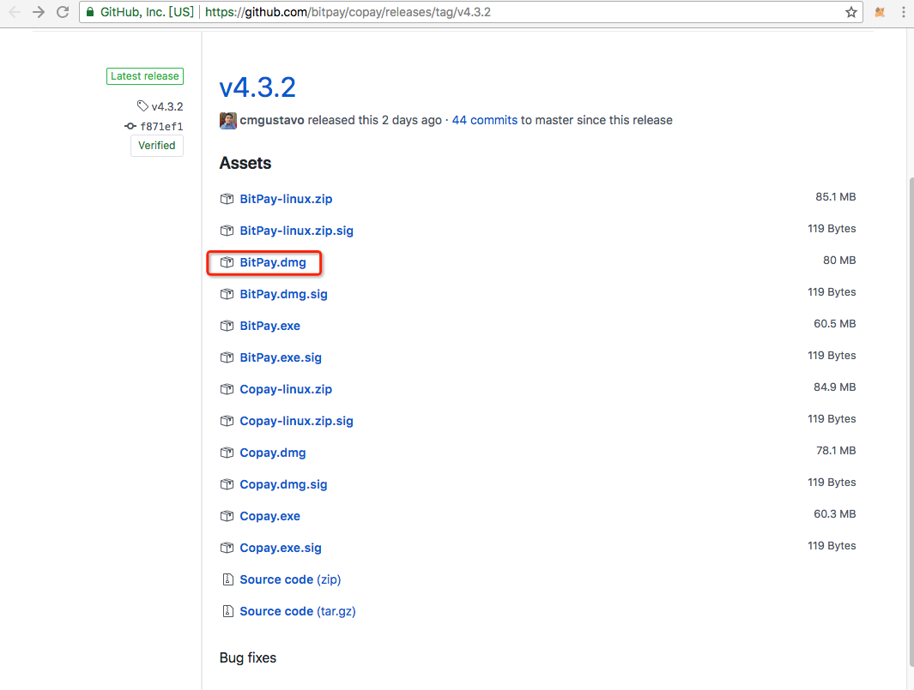
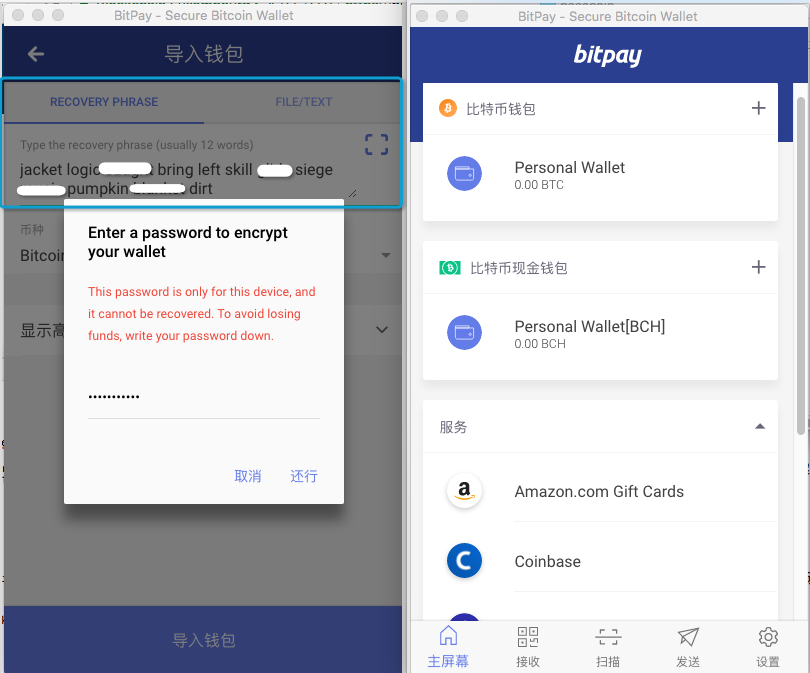

### 初始比特币与区块链
#### 1、比特币的起源

* 比特币的诞生

    2008年9月爆发了全球金融危机，11月1号一位名为“Satoshi Nakamoto”（中文译名，中本聪）的网友在一个隐秘的密码学评论组上发布了《比特币白皮书：一种点对点的电子现金系统》的白皮书，描述了一个全新的数字货币系统比特币，用于对抗金融危机带来的逐渐恶化的通货膨胀。
[比特币白皮书（中文翻译版）](http://www.8btc.com/wiki/bitcoin-a-peer-to-peer-electronic-cash-system)

    2009年1月，中本聪发布了开源的第一版比特币客户端，从此比特币诞生了。与此同时，中本聪通过挖矿打包生成了第一个区块（即“创世区块”），获取到了50个比特币。

    ==创世区块产生时间	 2009-01-03 18:15:05==
[比特币创世区块信息网址]
(https://blockchain.info/zh-cn/block-height/0)

* 神秘人物中本聪

    中本聪曾被提名为2016年诺比尔经济学奖候选人，但是世界上却没有人能够找到他。
中本聪只是一个化名，可能是一个人，也可能是一个组织。

    2014年美国《新闻周刊》称已找到中本聪，当时为64岁的美籍日本人，住在加利福尼亚州洛杉矶。其身份曾是京都大学数学教授的望月新一，但是被众人怀疑，不是密码学专家，没有Dev/加密的编码经验。


    [知乎：中本聪是怎么做到在人肉搜索那么强大的互联网上隐藏自己的身份的？](https://www.zhihu.com/question/22199390)

    中本聪人物描述：
    编程里面最懂密码学的人，密码学里面最懂经济学的人，经济学里面最会编程的人。

    传说中本聪手握100多万个比特币，按照目前比特币价格算，身价上百亿美元（数学是体育老师教的，不知道算得对不对，哈哈）。

    比特币价格查看（2018年5月9日约$9400），网址：
    http://price.btcfans.com/
    


    相关阅读：
    [谁是中本聪？](http://www.8btc.com/zhongbencong-shishui)
    [中本聪（Satoshi Nakamot）](http://8btc.com/article-25-1.html)

#### 2、比特币钱包客户端
* Bitcoin Core

    比特币钱包客户端的原名为Bitcoin-QT（QT钱包），现在更名为Bitcoin Core（核心钱包），官方下载地址：

    [https://bitcoin.org/zh_CN/choose-your-wallet]()
    

    

    该钱包是最完整、最安全、最早的比特币客户端，但是区块链数据文件体积庞大（17年初底下载会占用100多G硬盘空间），启动较慢

    运行比特币测试网络命令：

    ```
    bitcoin-qt -testnet
    ```
    申请测试网路(testnet)比特币：
    [https://testnet.manu.backend.hamburg/faucet](https://testnet.manu.backend.hamburg/faucet)
    输入框比特币地址，然后点右边的"Give me some coins"，没有翻墙的情况下，会出现如图的错误提示：
    

    查看账户余额地址：

    ```
    https://www.blocktrail.com/tBTC/address/xxx
    ```
    xxx为你的比特币地址，如图：
    


    如果对比特币开发感兴趣，或者想研究比特币的一些命令的话，可以下载桌面版。平常使用建议下载手机版，支持Android、iOS、Windows Phone三种手机系统的下载。
    
    通过安装比特币钱包桌面客户端，找到保存去看数据的blocks文件夹，然后执行如下命令，查看当时中本聪在创世区块写下的一句话（具体操作不作展开，以下是Windows上面的截图）
    
    ```
    hexdump -n 10000 -C blk00000.dat
    ```
    
        
    The Times 03/Jan/2009 Chancellor on brink of second bailout for banks（2009年1月3日，财政大臣正处于实施第二轮银行紧急援助的边缘）
    这句话是泰晤士报当天的头版文章标题。Satoshi的引用，既是对该区块产生时间的说明，也是对金融危机巨大压力下，旧有的脆弱银行系统的讽刺。
        
* BitPay
Bitpay是一家全球性的比特币支付服务提供者，成立于2011年5月。2018年4月，宣布完成4000万美元的B轮融资。

    官网下载地址：
    https://copay.io/#download
      
    选择对应的平台，这里选择的是Mac OS X，
    
比特币没有找回密码的功能，创建帐号时会自动生成12个单词（也就是你的私钥），一定要保存好自己，同时注意保密（具体步骤不作描述）

安装打开后，界面如下：
左边是可以通过输入12个单词来恢复钱包，右边是主界面。

    查询比特币余额等信息，可以通过打开类似如下地址：
    [https://blockchain.info/address/1CZPTGSkwX7D9PJgtFaVK7MGQseAnBwQ1h](https://blockchain.info/address/1CZPTGSkwX7D9PJgtFaVK7MGQseAnBwQ1h)
    https://blockchain.info/address/xxx
，xxx是对应比特币地址
    “1CZPTGSkwX7D9PJgtFaVK7MGQseAnBwQ1h”是本人的比特币钱包信息，超级大土豪砸点比特币过来吧，哈哈

#### 3、比特币在全球
比特币经过9年多的发展从未发生过重大安全事故，其技术和用户基础都十分强大。

* 全球对比特币的态度

    比特币在全球各国待遇差异明显，目前德国、日本、法国、加拿大、美国加州、印度等国家已承认了加密数字货币的合法性，而中国、韩国、俄罗斯等国家十分严格甚至完全禁止。日本对比特币的态度十分积极，是全球最大的比特币交易市场，甚至都可以用比特币购买房产。

    

* 国家对比特币的态度
   国内已经禁止比特币交易平台，ICO被国家七个部门定为非法融资。
   
   以下摘自百度百科：
   2017年9月4日，中国央行等七部委联合发布公告，全面叫停代币融资。
   官方要求，任何所谓的代币融资交易平台不得从事法定货币与代币、“虚拟货币”相互之间的兑换业务，不得买卖或作为中央对手方买卖代币或“虚拟货币”，不得为代币或“虚拟货币”提供定价、信息中介等服务。

#### 4、比特币与区块链
* 数字货币
  比特币（BTC）一种全新的基于P2P分布式网络，采用密码学交易（非对称加密，公钥锁定比特币，私钥解锁），基于区块链作为账本的数字货币
  比特币系统中，经过6个以上区块确认的交易才是安全确认，篡改成本巨大
  以太坊（区块链2.0）平台的以太币也属于一种数字货币，共有链上发起任何一笔交易也一样需要支付一定的交易费。

* 共识机制
  共识机制是区块链事务达成分布式共识的算法。
  比特币采用的是PoW（Proof of Work，工作量证明），使区块的创建变得困难，阻止攻击者恶意重新生成区块链，确保网络安全。电脑的算力越强，挖到比特币的概率越大，得到的比特币越多，回报越大。个人PC早已经挖不到矿了，现在都是矿池来挖矿。其他的共识机制还有PoS（股权证明）、DPos（委托权益证明）、PBFT（拜占庭容错算法）等。

* 区块链发展
  区块链1.0：以比特币为代表的数字货币应用，解决了货币和支付手段的去中心化，出现了如域名币、点点币、莱特币之类的各种”山寨币“  
  区块链2.0：以太坊平台为代表，为”智能合约“为主导，延伸到金融交易、证券结算清算、身份认证等领域
  区块链3.0：以IBM的Hyperledger为代表，超越货币、经济和市场，为各个行业提供去中心化解决方案

* 其他概念（不作展开）
区块链的分叉：硬分叉和软分叉
ICO：首次公开发售代币
DApp：去中心化应用
DAO：去中心化组织
共有链、侧链、私有链、联盟链
Merkle树、非对称加密、数字签名
双花问题、拜占庭将军问题等等

#### 5、区块链应用场景
* 金融科技
  英国央行加密货币RSCoin
  招商银行区块链直联跨境支付
  兴业银行区块链防伪平台
  
* 慈善公益
  腾讯可信区块链”公益寻人链“ 
  蚂蚁金服”支付宝爱心捐赠平台“
  阳光公益联盟链 
    
* 与其他技术相结合
  大数据
  物联网
  人工智能


