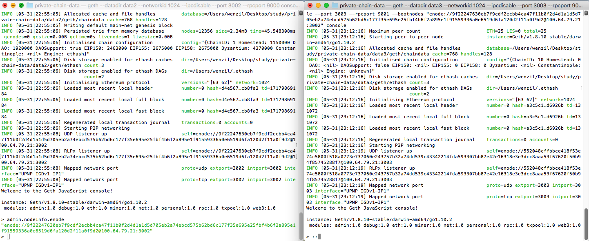

### 搭建以太坊私有链

#### 1、区块链类型

根据区块链的网络类型分类，目前区块链主要分为三种类型，即共有链、私有链和联盟链。

1、共有链(Public Blockchain)：对所有人开放，各参与者（即节点）可自由加入以及退出网络，所有数据公开透明，通常被认为是真正意义上的完全去中心化的区块链，如比特币、以太坊、EOS等。

共有链又分为主网和测试网络。
主网（MainNet）：正式上线的区块链网路，主网上线才代表这是一个真正的区块链。
很多项目都在筹备着主网上线，如IPFS、EOS等，正所谓上主网必大涨。

测试网络（TestNet）：专门给用户用来开发、测试和调试用的区块链网络。
如在以太坊平台，目前在运行的测试网络有三个，分别是Ropsten、Kovan和Rinkeby。在测试网络，以太币价值更低，也更容易得到。

2、私有链（Private Blockchain）：写入权限有由某个组织或者机构全权控制，参与节点的资格会被严格限制。参与的节点有限和可控，因此其主要特点是极快的交易速度、更低的交易成本、更好的隐私保护、不容易被恶意篡改。

3、联盟链（Consortium Blockchain）：由若干个机构共同参与管理，若干个机构共同参与管理，每个机构都运行着一个或多个节点，其中的数据只允许系统内不同的机构进行读写和发送交易，并且共同来记录交易数据，如Hyperledger、R3 Corda等。

**注意：以下操作均在MacOS上面操作**

#### 2、安装前提
在私有链进行开发和测试不需要同步共有链大量的区块数据，也不需要花钱购买以太币，可以通过模拟挖矿获取以太币。

1、安装Homebrew：

```
/usr/bin/ruby -e "$(curl -fsSL https://raw.githubusercontent.com/Homebrew/install/master/install)"
```

2、安装Go：

```
brew install go
```

检查安装版本

```
wenzildeiMac:~ wenzil$ go version
go version go1.10.2 darwin/amd64
```

下载Go之后，需要配置下系统环境变量，这里不作描述。

3、安装Go-Ethereum客户端（安装Geth
方法一，推荐）：

geth是以太坊的官方客户端，提供很多命令和选项，可以运行以太坊节点、创建和管理账户、发送交易、挖矿、部署智能合约到区块链等。

安装命令：

```
brew tap ethereum/ethereum
brew install ethereum
```

```
wenzildeiMac:private-chain-data wenzil$ brew tap ethereum/ethereum
Updating Homebrew...
==> Auto-updated Homebrew!
Updated 1 tap (homebrew/core).
==> New Formulae

##########此处省略多行输出内容##########
==> Tapping ethereum/ethereum
Cloning into '/usr/local/Homebrew/Library/Taps/ethereum/homebrew-ethereum'...
remote: Counting objects: 6, done.
remote: Compressing objects: 100% (6/6), done.
remote: Total 6 (delta 1), reused 0 (delta 0), pack-reused 0
Unpacking objects: 100% (6/6), done.
Tapped 3 formulae (32 files, 30.4KB)
wenzildeiMac:private-chain-data wenzil$ brew install ethereum  
Updating Homebrew...
==> Auto-updated Homebrew!
Updated 1 tap (homebrew/core).
==> Updated Formulae
hopenpgp-tools

==> Downloading https://homebrew.bintray.com/bottles/ethereum-1.8.10.high_

##########此处省略多行输出内容##########
==> Pouring ethereum-1.8.10.high_sierra.bottle.tar.gz
🍺  /usr/local/Cellar/ethereum/1.8.10: 18 files, 204MB

##########检查版本号##########
wenzildeiMac:private-chain-data wenzil$ geth version
Geth
Version: 1.8.10-stable
Architecture: amd64
Protocol Versions: [63 62]
Network Id: 1
Go Version: go1.10.2
Operating System: darwin
GOPATH=/usr/local/Cellar/go/1.10.2
GOROOT=/usr/local/Cellar/go/1.10.2/libexec                     
```

4、安装Geth命令行工具（安装Geth方法二，比方法一稍微麻烦一点）：

也可以通过Github下载源码进行编译，Github地址：

```
https://github.com/ethereum/go-ethereum.git
```

下载成功后，需要手动编译：

```
wenzildeiMac:go-ethereum wenzil$ pwd
/Users/wenzil/Desktop/study/go-ethereum
wenzildeiMac:go-ethereum wenzil$ make geth
build/env.sh go run build/ci.go install ./cmd/geth
>>> /usr/local/Cellar/go/1.10.2/libexec/bin/go install -ldflags -X main.gitCommit=1da33028ce88c4365d99471977098f4911fd38fa -s -v ./cmd/geth
github.com/ethereum/go-ethereum/common/hexutil
github.com/ethereum/go-ethereum/vendor/github.com/hashicorp/golang-lru/simplelru
##########此处省略多行输出内容##########
github.com/ethereum/go-ethereum/cmd/geth
Done building.
Run "/Users/wenzil/Desktop/study/go-ethereum/build/bin/geth" to launch geth.

wenzildeiMac:go-ethereum wenzil$ make all
build/env.sh go run build/ci.go install
>>> /usr/local/Cellar/go/1.10.2/libexec/bin/go install -ldflags -X main.gitCommit=1da
##########此处省略多行输出内容##########
github.com/ethereum/go-ethereum/whisper/shhclient
github.com/ethereum/go-ethereum/whisper/whisperv5

##########检查版本号##########
wenzildeiMac:go-ethereum wenzil$ ./build/bin/geth version
Geth
Version: 1.8.7-unstable
Git Commit: 1da33028ce88c4365d99471977098f4911fd38fa
Architecture: amd64
Protocol Versions: [63 62]
Network Id: 1
Go Version: go1.10.2
Operating System: darwin
GOPATH=/usr/local/Cellar/go/1.10.2
GOROOT=/usr/local/Cellar/go/1.10.2/libexec
```

5、安装Solidity编译器：
Solidity是一个面向合约的高级语言,其语法类似于JavaScript，以太坊的智能合约使用的是Solidity语言。

```
wenzildeiMac:~ wenzil$ brew install solidity
==> Installing solidity from ethereum/ethereum
==> Installing dependencies for ethereum/ethereum/solidity: cmake, z3
==> Installing ethereum/ethereum/solidity dependency: cmake
==> Downloading https://homebrew.bintray.com/bottles/cmake-3.11.2.high_sierra.bo
######################################################################## 100.0%
==> Pouring cmake-3.11.2.high_sierra.bottle.tar.gz
##########此处省略多行输出内容##########
==> Downloading https://github.com/ethereum/solidity/releases/download/v0.4.24/s
==> Downloading from https://github-production-release-asset-2e65be.s3.amazonaws
######################################################################## 100.0%
==> cmake . -DCMAKE_C_FLAGS_RELEASE=-DNDEBUG -DCMAKE_CXX_FLAGS_RELEASE=-DNDEBUG 
==> make install
🍺  /usr/local/Cellar/solidity/0.4.24: 6 files, 5.5MB, built in 3 minutes 33 seconds
```

注意：下载和安装比较慢，可以会失败，重新执行"brew install solidity"命令即可。

#### 3、创建私有链网络

一般来说，都是不同的电脑（节点）组成私有链。这里为了方便，演示如何在同一台电脑搭建以太坊私有链网络。

1、创建用于保存私有链数据的文件夹

```
wenzildeiMac:go-ethereum wenzil$ pwd
/Users/wenzil/Desktop/study/go-ethereum
wenzildeiMac:go-ethereum wenzil$ cd ..
wenzildeiMac:study wenzil$ pwd
/Users/wenzil/Desktop/study
wenzildeiMac:study wenzil$ mkdir private-chain-data
wenzildeiMac:study wenzil$ cd private-chain-data/
```

2、使用geth命令启动私有链节点：

```
geth --networkid 1024 --dev --datadir data1 --rpc --rpcaddr 192.168.xxx.xxx --rpcport 8989 --port 3000

--identity：指定节点 ID；
--rpc：表示开启 HTTP-RPC 服务；
--rpcaddr：HTTP-RPC 服务ip地址；
--rpcport：指定 HTTP-RPC 服务监听端口号（默认为 8545）；
--datadir：指定区块链数据的存储位置；
--port：指定和其他节点连接所用的端口号（默认为 30303）；
--nodiscover：关闭节点发现机制，防止加入有同样初始配置的陌生节点

192.168.xxx.xxx为对应的IP地址
```

3、在命令行输入：

```
geth --networkid 1024 --dev --datadir data1 --rpc --rpcaddr 192.168.1.100 --rpcport 8989 --port 3000
```

192.168.1.100为我本机的IP地址。

```
wenzildeiMac:private-chain-data wenzil$ geth --networkid 1024 --dev --datadir data1 --rpc --rpcaddr 192.168.1.100 --rpcport 8989 --port 3000
INFO [05-31|19:29:05] Maximum peer count                       ETH=25 LES=0 total=25
INFO [05-31|19:29:07] Using developer account                  address=0x84497a30D1f54E11D2bfE7bae56edb8144B6dd9D
INFO [05-31|19:29:07] Starting peer-to-peer node               instance=Geth/v1.8.10-stable/darwin-amd64/go1.10.2
INFO [05-31|19:29:07] Allocated cache and file handles         database=/Users/wenzil/Desktop/study/private-chain-data/data1/geth/chaindata cache=768 handles=128
INFO [05-31|19:29:07] Writing custom genesis block 
INFO [05-31|19:29:07] Persisted trie from memory database      nodes=11 size=2.17kB time=58.535µs gcnodes=0 gcsize=0.00B gctime=0s livenodes=1 livesize=0.00B
INFO [05-31|19:29:07] Initialised chain configuration                    versions="[63 62]" network=123
##########此处省略多行输出内容##########INFO [05-31|16:29:07] Commit new mining work                   number=1 txs=0 uncles=0 elapsed=71.562µs
WARN [05-31|19:29:07] Block sealing failed                     err="waiting for transactions"

```

4、打开"private-chain-data"文件夹，会发现多了几个文件。


#### 4、使用JavaScript Console交互

可以进入JavaScript Console执行环境，使用里面的内置对象做一些操作，这些内置对象提供的功能很丰富，比如查看区块和交易、创建账户、挖矿、发送交易、部署智能合约等。

```
geth attach ipc:<data1>/geth.ipc

eth：包含一些跟操作区块链相关的方法；
net：包含一些查看p2p网络状态的方法；
admin：包含一些与管理节点相关的方法；
miner：包含启动&停止挖矿的一些方法；
personal：主要包含一些管理账户的方法；
txpool：包含一些查看交易内存池的方法；
web3：包含了以上对象，还包含一些单位换算的方法。
```


保持私有链节点的运行，打开新的终端，操作如下：

```
wenzildeiMac:~ wenzil$ geth attach ipc:/Users/wenzil/Desktop/study/private-chain-data/data1/geth.ipc
Welcome to the Geth JavaScript console!

instance: Geth/v1.8.10-stable/darwin-amd64/go1.10.2
coinbase: 0x84497a30d1f54e11d2bfe7bae56edb8144b6dd9d
at block: 0 (Thu, 01 Jan 1970 08:00:00 CST)
 datadir: /Users/wenzil/Desktop/study/private-chain-data/data1
 modules: admin:1.0 clique:1.0 debug:1.0 eth:1.0 miner:1.0 net:1.0 personal:1.0 rpc:1.0 shh:1.0 txpool:1.0 web3:1.0

> eth.accounts
["0x84497a30d1f54e11d2bfe7bae56edb8144b6dd9d"]
> personal.newAccount("wenzil")
"0xc81f9f0561a0820483ce9a9dec621bb6667dbfa6"
> personal.listAccounts
["0x84497a30d1f54e11d2bfe7bae56edb8144b6dd9d", "0xc81f9f0561a0820483ce9a9dec621bb6667dbfa6"]
> eth.accounts
["0x84497a30d1f54e11d2bfe7bae56edb8144b6dd9d", "0xc81f9f0561a0820483ce9a9dec621bb6667dbfa6"]
> web3.eth.coinbase
"0x84497a30d1f54e11d2bfe7bae56edb8144b6dd9d"
> personal.listAccounts[0]
"0x84497a30d1f54e11d2bfe7bae56edb8144b6dd9d"
> eth.getBalance(personal.listAccounts[0])
1.15792089237316195423570985008687907853269984665640564039457584007913129639927e+77
> eth.getBalance(personal.listAccounts[1])
0

> web3.fromWei(eth.getBalance(personal.listAccounts[0]).toNumber(), 'ether');
"115792089237316200000000000000000000000000000000000000000000"
> web3.fromWei(eth.getBalance(personal.listAccounts[1]).toNumber(), 'ether');
"0"

###发送转账交易，返回交易的哈希###
> sendEther = web3.toWei(5, 'ether');
> eth.sendTransaction({from: web3.eth.coinbase, to:personal.listAccounts[1], value:sendEther})
"0x70b014b7ded02aadb2e78c48e1ab8762694ffb82d0189e180b14318ec8455cd7"
###查看交易的状态###
> txpool.status
{
  pending: 1,
  queued: 0
}
> miner.start()
null
> miner.stop()
true
> txpool.status

{
  pending: 0,
  queued: 0
}
###发现转账成功###
> web3.fromWei(eth.getBalance(personal.listAccounts[1]).toNumber(), 'ether');
"5"
> eth.blockNumber
1
> eth.getTransaction("0x70b014b7ded02aadb2e78c48e1ab8762694ffb82d0189e180b14318ec8455cd7")
{
  blockHash: "0x07944f163f2bdb4f49ee870dd39175e2f1010ef4b8871eb3a3447916d186dee2",
  blockNumber: 1,
  from: "0x84497a30d1f54e11d2bfe7bae56edb8144b6dd9d",
  gas: 90000,
  gasPrice: 1,
  hash: "0x70b014b7ded02aadb2e78c48e1ab8762694ffb82d0189e180b14318ec8455cd7",
  input: "0x",
  nonce: 0,
  r: "0x2865f45643c43abd258c2fd12b2a3187d4ad98c4dfda9bd2804e92f78fd0c803",
  s: "0x4923415a88799ab3d3c7cf0d41bc2b9cedaa033c346cf41a229eff3703b1d7f8",
  to: "0xc81f9f0561a0820483ce9a9dec621bb6667dbfa6",
  transactionIndex: 0,
  v: "0xa96",
  value: 5000000000000000000
}
> eth.getBlock(1)
{
  difficulty: 2,
  extraData: "0xd98301080a846765746888676f312e31302e328664617277696e000000000000b3e4f8e50c4c8d1b9ccfda57ca557cf86b41220ffbefb38956621c6a716afb5547c7a4852494ee16ec0d9ff4f5352307659babdc8b5e57c604852c2c2a3a996301",
  gasLimit: 6277051,
  gasUsed: 21000,
  hash: "0x07944f163f2bdb4f49ee870dd39175e2f1010ef4b8871eb3a3447916d186dee2",
  logsBloom: "0x00000000000000000000000000000000000000000000000000000000000000000000000000000000000000000000000000000000000000000000000000000000000000000000000000000000000000000000000000000000000000000000000000000000000000000000000000000000000000000000000000000000000000000000000000000000000000000000000000000000000000000000000000000000000000000000000000000000000000000000000000000000000000000000000000000000000000000000000000000000000000000000000000000000000000000000000000000000000000000000000000000000000000000000000000000000",
  miner: "0x0000000000000000000000000000000000000000",
  mixHash: "0x0000000000000000000000000000000000000000000000000000000000000000",
  nonce: "0x0000000000000000",
  number: 1,
  parentHash: "0x66bcc11d1680c2d52d09aa6f113d4306f089728598202467cbde72213f12a0ae",
  receiptsRoot: "0x056b23fbba480696b65fe5a59b8f2148a1299103c4f57df839233af2cf4ca2d2",
  sha3Uncles: "0x1dcc4de8dec75d7aab85b567b6ccd41ad312451b948a7413f0a142fd40d49347",
  size: 717,
  stateRoot: "0xf4c4362504f7b2eacff4ed57dc82f578f275ff49a6f644ddc4062b3b7a3cf935",
  timestamp: 1527759405,
  totalDifficulty: 3,
  transactions: ["0x70b014b7ded02aadb2e78c48e1ab8762694ffb82d0189e180b14318ec8455cd7"],
  transactionsRoot: "0x8c3c2e1e0a536874aafd9d40f09d1519c5537dceff0dbd28d9ba6118d37dea7b",
  uncles: []
}
> 
> miner.setEtherbase(eth.accounts[1])
true
> eth.getBalance(eth.coinbase)
5000000000000000000
> web3.fromWei(eth.getBalance(eth.coinbase))
5
```

对应命令说明:

eth.accounts // 查询账号列表

personal.listAccounts //查询账号列表

personal.newAccount("xxx") //新建账号，xxx为账户账号

web3.eth.coinbase // 节点挖矿的账号地址，默认为账号列表的第一个账号

personal.listAccounts[0] // 查看账号列表的第一个账号

eth.getBalance("xxx") //查看对应账号的余额，xxx为账号地址

miner.start()       // 开始挖矿

miner.stop()        // 停止挖矿

txpool.status       // 查看交易的状态

eth.blockNumber     // 查看交易的区块号

eth.getTransaction  // 查看交易区块信息

eth.getBlock(xxx)    // 根据区块号查看区块信息，xxx为区块号

miner.setEtherbase(xxx)    // 设置挖矿的账号，xxx为账号地址

getBalance()     // 返回值的单位是wei，wei是以太币的最小单位，1个以太币=10的18次方个wei。要查看有多少个以太币，可以用web3.fromWei()将返回值换算成以太币

##### 5、私有链网络建立节点集群

1、启动一个节点，命令行输入：

```
wenzildeiMac:private-chain-data wenzil$ geth --datadir data2 --networkid 1024 --ipcdisable --port 3002 --rpcport 9000 console
INFO [05-31|22:55:05] Maximum peer count                       ETH=25 LES=0 total=25
INFO [05-31|22:55:05] Starting peer-to-peer node               instance=Geth/v1.8.10-stable/darwin-amd64/go1.10.2
INFO [05-31|22:55:05] Allocated cache and file handles         database=/Users/wenzil/Desktop/study/private-chain-data/data2/geth/chaindata cache=768 handles=128
INFO [05-31|22:55:05] Writing default main-net genesis block 
INFO [05-31|22:55:06] Persisted trie from memory database      nodes=12356 size=2.34mB time=45.548308ms gcnodes=0 gcsize=0.00B gctime=0s livenodes=1 livesize=0.00B
INFO [05-31|22:55:06] Initialised chain configuration          config="{ChainID: 1 Homestead: 1150000 DAO: 1920000 DAOSupport: true EIP150: 2463000 EIP155: 2675000 EIP158: 2675000 Byzantium: 4370000 Constantinople: <nil> Engine: ethash}"
INFO [05-31|22:55:06] Disk storage enabled for ethash caches   dir=/Users/wenzil/Desktop/study/private-chain-data/data2/geth/ethash count=3
INFO [05-31|22:55:06] Disk storage enabled for ethash DAGs     dir=/Users/wenzil/.ethash                                            count=2
INFO [05-31|22:55:06] Initialising Ethereum protocol           versions="[63 62]" network=1024
INFO [05-31|22:55:06] Loaded most recent local header          number=0 hash=d4e567…cb8fa3 td=17179869184
INFO [05-31|22:55:06] Loaded most recent local full block      number=0 hash=d4e567…cb8fa3 td=17179869184
INFO [05-31|22:55:06] Loaded most recent local fast block      number=0 hash=d4e567…cb8fa3 td=17179869184
INFO [05-31|22:55:06] Regenerated local transaction journal    transactions=0 accounts=0
INFO [05-31|22:55:06] Starting P2P networking 
INFO [05-31|22:55:08] UDP listener up                          self=enode://9f22247630eb7f9cdf2ecbb4ca47f11b0f2d4d1a1d5d705eb2a74ebcd575b62bd6c177f35e695e25fbf4b6f2a895e1f91559336a0e6519d6fa120d2f11a0f9d2@100.64.79.21:3002
INFO [05-31|22:55:08] RLPx listener up                         self=enode://9f22247630eb7f9cdf2ecbb4ca47f11b0f2d4d1a1d5d705eb2a74ebcd575b62bd6c177f35e695e25fbf4b6f2a895e1f91559336a0e6519d6fa120d2f11a0f9d2@100.64.79.21:3002
INFO [05-31|22:55:08] Mapped network port                      proto=udp extport=3002 intport=3002 interface="UPNP IGDv1-IP1"
INFO [05-31|22:55:08] Mapped network port                      proto=tcp extport=3002 intport=3002 interface="UPNP IGDv1-IP1"
Welcome to the Geth JavaScript console!

instance: Geth/v1.8.10-stable/darwin-amd64/go1.10.2
 modules: admin:1.0 debug:1.0 eth:1.0 miner:1.0 net:1.0 personal:1.0 rpc:1.0 txpool:1.0 web3:1.0

```

2、命令行获取节点实例Enoded url：

Enoded url是和另外一个节点互动的唯一id。

```
> admin.nodeInfo.enode
"enode://9f22247630eb7f9cdf2ecbb4ca47f11b0f2d4d1a1d5d705eb2a74ebcd575b62bd6c177f35e695e25fbf4b6f2a895e1f91559336a0e6519d6fa120d2f11a0f9d2@100.64.79.21:3002"
> 
```

3、打开新的终端，初始化第二个节点：

```
wenzildeiMac:private-chain-data wenzil$ geth --datadir data3 init ./genesis.json 
INFO [05-31|23:09:37] Maximum peer count                       ETH=25 LES=0 total=25
INFO [05-31|23:09:37] Allocated cache and file handles         database=/Users/wenzil/Desktop/study/private-chain-data/data3/geth/chaindata cache=16 handles=16
INFO [05-31|23:09:37] Writing custom genesis block 
INFO [05-31|23:09:37] Persisted trie from memory database      nodes=3 size=505.00B time=124.381µs gcnodes=0 gcsize=0.00B gctime=0s livenodes=1 livesize=0.00B
INFO [05-31|23:09:37] Successfully wrote genesis state         database=chaindata                                                           hash=a3c5c1…d6926b
INFO [05-31|23:09:37] Allocated cache and file handles         database=/Users/wenzil/Desktop/study/private-chain-data/data3/geth/lightchaindata cache=16 handles=16
INFO [05-31|23:09:37] Writing custom genesis block 
INFO [05-31|23:09:37] Persisted trie from memory database      nodes=3 size=505.00B time=44.996µs  gcnodes=0 gcsize=0.00B gctime=0s livenodes=1 livesize=0.00B
INFO [05-31|23:09:37] Successfully wrote genesis state         database=lightchaindata                                                           hash=a3c5c1…d6926b
```

4、启动第二个节点：

命令如下

```
geth --datadir data3 --networkid 1024 --ipcdisable --port 3003 --rpcport 9001 --bootnodes "enode://9f22247630eb7f9cdf2ecbb4ca47f11b0f2d4d1a1d5d705eb2a74ebcd575b62bd6c177f35e695e25fbf4b6f2a895e1f91559336a0e6519d6fa120d2f11a0f9d2@100.64.79.21:3002" console
```

操作结果如下

```
wenzildeiMac:private-chain-data wenzil$ geth --datadir data3 --networkid 1024 --ipcdisable --port 3003 --rpcport 9001 --bootnodes "enode://9f22247630eb7f9cdf2ecbb4ca47f11b0f2d4d1a1d5d705eb2a74ebcd575b62bd6c177f35e695e25fbf4b6f2a895e1f91559336a0e6519d6fa120d2f11a0f9d2@100.64.79.21:3002" console
INFO [05-31|23:12:16] Maximum peer count                       ETH=25 LES=0 total=25
INFO [05-31|23:12:16] Starting peer-to-peer node               instance=Geth/v1.8.10-stable/darwin-amd64/go1.10.2
INFO [05-31|23:12:16] Allocated cache and file handles         database=/Users/wenzil/Desktop/study/private-chain-data/data3/geth/chaindata cache=768 handles=128
INFO [05-31|23:12:16] Initialised chain configuration          config="{ChainID: 10 Homestead: 0 DAO: <nil> DAOSupport: false EIP150: <nil> EIP155: 0 EIP158: 0 Byzantium: <nil> Constantinople: <nil> Engine: unknown}"
INFO [05-31|23:12:16] Disk storage enabled for ethash caches   dir=/Users/wenzil/Desktop/study/private-chain-data/data3/geth/ethash count=3
INFO [05-31|23:12:16] Disk storage enabled for ethash DAGs     dir=/Users/wenzil/.ethash                                            count=2
INFO [05-31|23:12:16] Initialising Ethereum protocol           versions="[63 62]" network=1024
INFO [05-31|23:12:16] Loaded most recent local header          number=0 hash=a3c5c1…d6926b td=131072
INFO [05-31|23:12:16] Loaded most recent local full block      number=0 hash=a3c5c1…d6926b td=131072
INFO [05-31|23:12:16] Loaded most recent local fast block      number=0 hash=a3c5c1…d6926b td=131072
INFO [05-31|23:12:16] Regenerated local transaction journal    transactions=0 accounts=0
INFO [05-31|23:12:16] Starting P2P networking 
INFO [05-31|23:12:19] UDP listener up                          self=enode://552048cffbbce418f53e74c5800f518a0773e737060e243757b32a74dd539c43342214fda593307bb87e42e16318e3e3dcc8aaa53f67620f50b94f85745288f7@100.64.79.21:3003
INFO [05-31|23:12:19] RLPx listener up                         self=enode://552048cffbbce418f53e74c5800f518a0773e737060e243757b32a74dd539c43342214fda593307bb87e42e16318e3e3dcc8aaa53f67620f50b94f85745288f7@100.64.79.21:3003
INFO [05-31|23:12:19] Mapped network port                      proto=udp extport=3003 intport=3003 interface="UPNP IGDv1-IP1"
INFO [05-31|23:12:19] Mapped network port                      proto=tcp extport=3003 intport=3003 interface="UPNP IGDv1-IP1"
Welcome to the Geth JavaScript console!

instance: Geth/v1.8.10-stable/darwin-amd64/go1.10.2
 modules: admin:1.0 debug:1.0 eth:1.0 miner:1.0 net:1.0 personal:1.0 rpc:1.0 txpool:1.0 web3:1.0

> 
```

--bootndoes的值来链接第一个节点，后面跟着"admin.nodeInfo.enode"得到的值。也可以先不设置--bootnodes，直接启动节点，进入命令行后通过admin.addPeer(enodeUrl)来添加第一个节点。



5、第二个节点输入：

```
> admin.nodeInfo
{
  enode: "enode://552048cffbbce418f53e74c5800f518a0773e737060e243757b32a74dd539c43342214fda593307bb87e42e16318e3e3dcc8aaa53f67620f50b94f85745288f7@100.64.79.21:3003",
  id: "552048cffbbce418f53e74c5800f518a0773e737060e243757b32a74dd539c43342214fda593307bb87e42e16318e3e3dcc8aaa53f67620f50b94f85745288f7",
  ip: "100.64.79.21",
  listenAddr: "[::]:3003",
  name: "Geth/v1.8.10-stable/darwin-amd64/go1.10.2",
  ports: {
    discovery: 3003,
    listener: 3003
  },
  protocols: {
    eth: {
      config: {
        chainId: 10,
        eip150Hash: "0x0000000000000000000000000000000000000000000000000000000000000000",
        eip155Block: 0,
        eip158Block: 0,
        homesteadBlock: 0
      },
      difficulty: 131072,
      genesis: "0xa3c5c170988f516e00ea3078b2461a149bcd4d0422c8c894923c6cfa22d6926b",
      head: "0xa3c5c170988f516e00ea3078b2461a149bcd4d0422c8c894923c6cfa22d6926b",
      network: 1024
    }
  }
}
```

6、第一个节点输入：

```
> web3.net.peerCount
1
> admin.peers
[{
    caps: ["eth/62", "eth/63"],
    id: "57802b43fe51c7356f429f07cf8f42e9c154a7b192b0d2f7a9b19be299f9e12fbcad9aac5f302127bc7c9a7a9f9f3d7cdaf07f9b4616ad5a23b060b70b3b2c9e",
    name: "Pirl/v1.8.1-premium-masternode-stablev3-824f23e3/linux-amd64/go1.10",
    network: {
      inbound: false,
      localAddress: "192.168.1.100:62505",
      remoteAddress: "195.201.134.19:30303",
      static: false,
      trusted: false
    },
    protocols: {
      eth: "handshake"
    }
}]
```

7、第二个节点设置挖矿的账户，并进行挖矿：

```
> eth.accounts
[]
###没有默认的账户###
> web3.eth.getBalance("0x0000000000000000000000000000000000000001")
111111111
###查看配置创世区块信息时设置的账户余额###
> miner.setEtherbase("0x0000000000000000000000000000000000000001")
true
###设置为挖矿的账户###
> eth.getBalance(eth.coinbase)
111111111
###查询账户的余额###
> personal.newAccount("wenzil")
"0x3f34992401fdd5c590be876d56e1d268f79c1635"
###新建一个账户的余额###
> eth.accounts
["0x3f34992401fdd5c590be876d56e1d268f79c1635"]
###查询账户列表###
> personal.listAccounts
["0x3f34992401fdd5c590be876d56e1d268f79c1635"]
###查询账户列表###
> miner.setEtherbase(personal.listAccounts[0])
true
###将新建的账户设置为挖矿的账户###
> eth.getBalance(eth.coinbase)
0
###查询主（挖矿）账户的余额###
> miner.start()
###开始挖矿###
INFO [06-01|00:54:42] Updated mining threads                   threads=0
INFO [06-01|00:54:42] Transaction pool price threshold updated price=18000000000
INFO [06-01|00:54:42] Starting mining operation 
null
> INFO [06-01|00:54:42] Commit new mining work                   number=1 txs=0 uncles=0 elapsed=169.586µs
INFO [06-01|00:54:43] Successfully sealed new block            number=1 hash=c24224…898e08
INFO [06-01|00:54:43] 🔨 mined potential block                  number=1 hash=c24224…898e08
##########此处省略多行输出内容##########
> INFO [06-01|00:57:13] Successfully sealed new block            number=66 hash=5e48f4…18a817
INFO [06-01|00:57:13] 🔗 block reached canonical chain          number=61 hash=d614e1…480f89
INFO [06-01|00:57:13] 🔨 mined potential block                  number=66 hash=5e48f4…18a817
INFO [06-01|00:57:13] Commit new mining work                   number=67 txs=0 uncles=0 elapsed=515.958µs
> miner.stopINFO [06-01|00:57:17] Successfully sealed new block            number=67 hash=b278b3…f57acc
INFO [06-01|00:57:17] 🔗 block reached canonical chain          number=62 hash=376431…468501
INFO [06-01|00:57:17] 🔨 mined potential block                  number=67 hash=b278b3…f57acc
INFO [06-01|00:57:17] Commit new mining work                   number=68 txs=0 uncles=0 elapsed=310.084µs
> miner.stop()
> true
###挖一段时间后，手动停止挖矿###
> eth.getBalance(eth.accounts[0])
335000000000000000000
> web3.fromWei(eth.getBalance(eth.accounts[0]).toNumber(), 'ether');
"335"
###挖个335个以太币###
```

8、查看第一个节点的账户信息：

```
> eth.accounts
["0x2cbe966aa14f0c77336fd0539e60e0c6381211ce"]
> eth.getBalance(eth.accounts[0])
0
```

9、第二个节点向第一个节点转账：


```
> personal.unlockAccount(eth.accounts[0], "wenzil")
true
###解锁帐号，密码为创建账户时输入的账户名###
> eth.sendTransaction({from: eth.accounts[0], to: "0x2cbe966aa14f0c77336fd0539e60e0c6381211ce", value: web3.toWei(1, "ether")})
INFO [06-01|01:19:32] Submitted transaction                    fullhash=0xd04debc8556a348761a5cedc991cf38a35cbc5cea2e112f61e29a47ef523b81c recipient=0x2cbe966AA14F0c77336fd0539E60E0c6381211ce
"0xd04debc8556a348761a5cedc991cf38a35cbc5cea2e112f61e29a47ef523b81c"
```

10、然后挖矿，成功后停止，让交易生效：

```
> eth.pendingTransactions
[{
    blockHash: null,
    blockNumber: null,
    from: "0x3f34992401fdd5c590be876d56e1d268f79c1635",
    gas: 90000,
    gasPrice: 18000000000,
    hash: "0x321192cbb1e891fb811c8c9e5224446511cd6d8c9661da6a23d27a200a2821d4",
    input: "0x",
    nonce: 1,
    r: "0x37510e6782d9209ad6f9c63e29685cfcfc1c293af47d7e9825201902dad5a211",
    s: "0x424b76ee28e5ea67ca0d8dded840be4b62c97482183bd11bb13c518d0622c107",
    to: "0x2cbe966aa14f0c77336fd0539e60e0c6381211ce",
    transactionIndex: 0,
    v: "0x37",
    value: 1000000000000000000
}]
> miner.start()
INFO [06-01|01:57:51] Updated mining threads                   threads=0
INFO [06-01|01:57:51] Transaction pool price threshold updated price=18000000000
INFO [06-01|01:57:51] Starting mining operation 

##########此处省略多行输出内容##########

> miner.stop()
> true
> eth.pendingTransactions
[]
```

11、第一个节点查看余额：

```
> eth.getBalance(eth.accounts[0])
1000000000000000000
```

第5节的”私有链网络建立节点集群“基本参考如下了网址。
网址：https://www.cnblogs.com/zl03jsj/p/6876064.html

