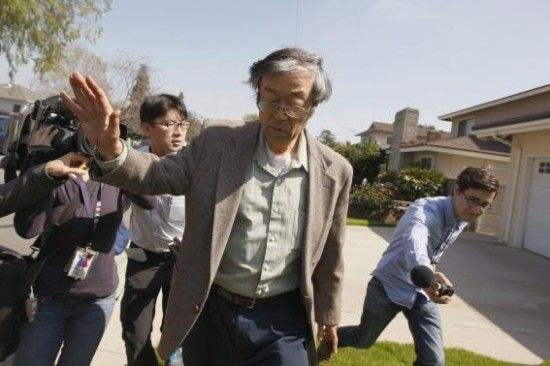
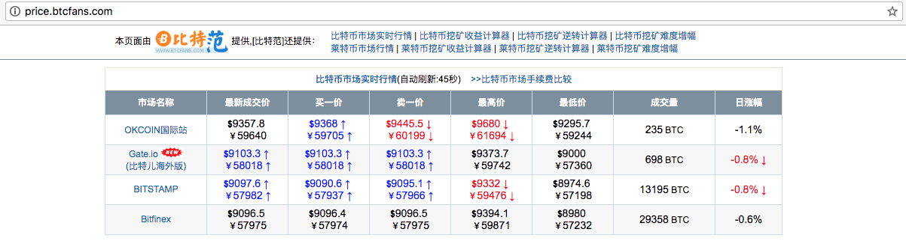
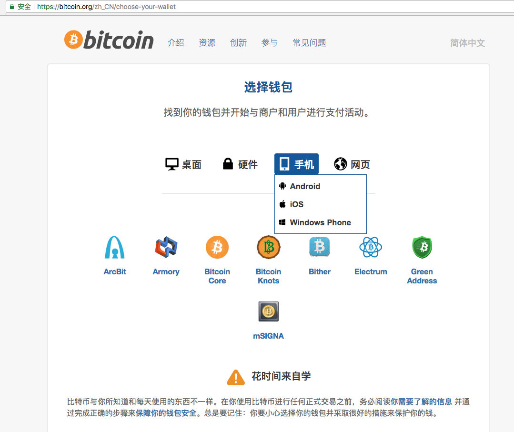
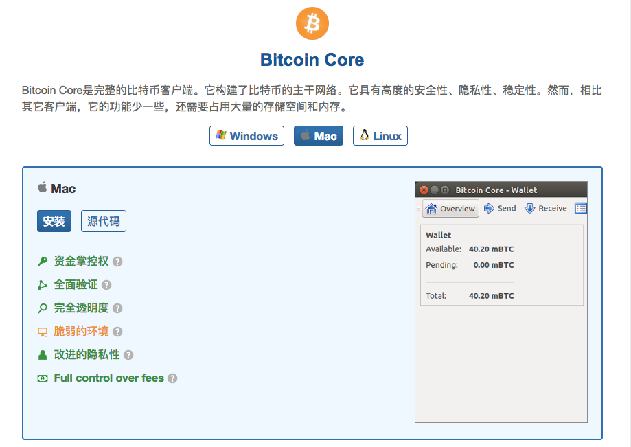
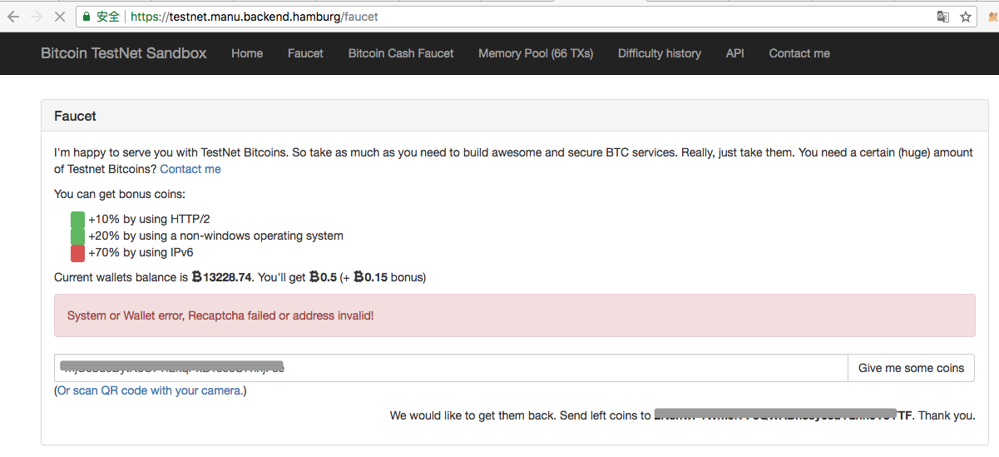
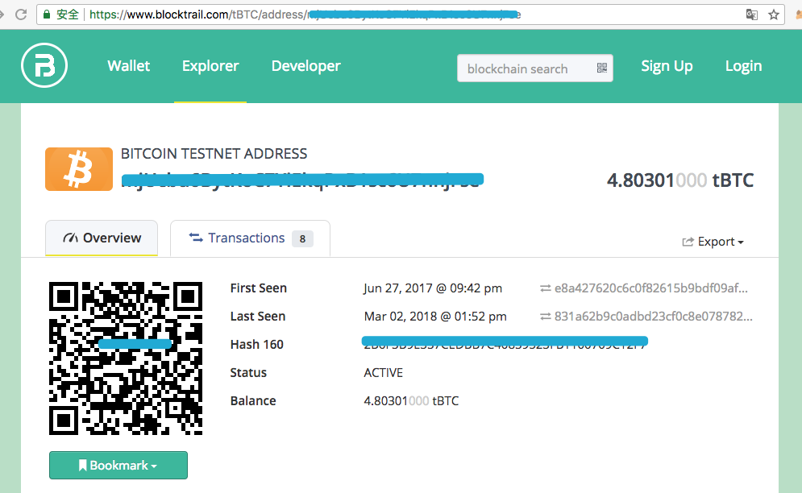

### 初始比特币
#### 1、比特币的起源
[知乎：中本聪是怎么做到在人肉搜索那么强大的互联网上隐藏自己的身份的？](https://www.zhihu.com/question/22199390)

神秘人物中本聪人物描述：
编程里面最懂密码学的人，密码学里面最懂经济学的人，经济学里面最会编程的人
14年美国《新闻周刊》称已找到中本聪，当时为64岁的美籍日本人，住在加利福尼亚州洛杉矶。其身份曾是京都大学数学教授的望月新一，但是被众人怀疑，不是密码学专家，没有Dev/加密的编码经验。


传说中本聪手握100多万个比特币，按照目前比特币价格算，身价上百亿美元（数学是体育老师教的，不知道算得对不对，哈哈）。

比特币价格查看（2018年5月9日约$9400），网址：
http://price.btcfans.com/


中本聪曾被提名为2016年诺比尔经济学奖候选人，但是世界上却没有人能够找到他。
中本聪只是一个化名，可能是一个人，也可能是一个组织。

相关阅读：
[谁是中本聪？](http://www.8btc.com/zhongbencong-shishui)
[中本聪（Satoshi Nakamot）](http://8btc.com/article-25-1.html)

#### 2、比特币钱包下载
比特币钱包客户端的原名为Bitcoin-QT（QT钱包），现在更名为Bitcoin Core（核心钱包），官方下载地址：
[https://bitcoin.org/zh_CN/choose-your-wallet](https://bitcoin.org/zh_CN/choose-your-wallet)




该钱包是最完整、最安全、最早的比特币客户端，但是区块链数据文件体积庞大（17年初底下载会占用100多G硬盘空间），启动较慢

运行比特币测试网络命令：

```
bitcoin-qt -testnet
```
申请测试网路(testnet)比特币：
[https://testnet.manu.backend.hamburg/faucet](https://testnet.manu.backend.hamburg/faucet)
输入框比特币地址，然后点右边的"Give me some coins"，没有翻墙的情况下，会出现如图的错误提示：


查看账户余额地址：

```
https://www.blocktrail.com/tBTC/address/xxx
```
xxx为你的比特币地址，如图：



如果对比特币开发感兴趣，或者想研究比特币的一些命令的话，可以下载桌面版。平常使用建议下载手机版，支持Android、iOS、Windows Phone三种手机系统的下载。

__注意：国内已经禁止比特币交易，仅适合学习。__

* 相关资讯，以下摘自网络：

        2017年9月4日，中国央行等七部委联合发布公告，全面叫停代币融资。
        官方要求，任何所谓的代币融资交易平台不得从事法定货币与代币、“虚拟货币”相互之间的兑换业务，不得买卖或作为中央对手方买卖代币或“虚拟货币”，不得为代币或“虚拟货币”提供定价、信息中介等服务。

#### 3、比特币与区块链
比特币在全球各国待遇差异明显，目前德国、日本、法国、加拿大、美国加州、印度等国家已承认了加密数字货币的合法性，而中国、韩国、俄罗斯等国家十分严格甚至完全禁止。日本对比特币的态度十分积极，是全球最大的比特币交易市场，甚至都可以用比特币购买房产。

比特币经过9年多的发展从未发生过重大安全事故，其技术和用户基础都十分强大。

==创世区块产生时间	 2009-01-03 18:15:05==
[比特币创世区块地址传送门]
(https://blockchain.info/zh-cn/block-height/0)

[比特币白皮书（中文翻译版）](http://www.8btc.com/wiki/bitcoin-a-peer-to-peer-electronic-cash-system)


查看中本聪写下的一句话

#### 4、比特币轻钱包

