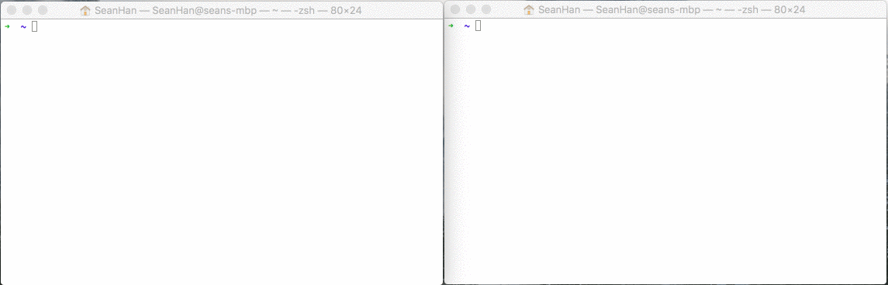
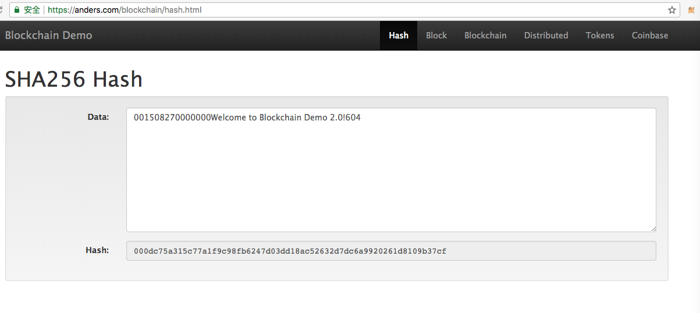

### 理解区块链结构和原理
#### 1、浏览器区块链Demo
区块链的概念起源于比特币，其本质上是一个去中心化的数据库，是分布式数据存储、点对点传输（P2P）、共识机制、加密算法等计算机技术的新型应用模式（摘自百科）。

为了更好地形象地了解区块链的一些概念和结构组成，可以查看浏览器版的区块链Demo。
[浏览器版区块链Demo](https://blockchaindemo.io/)

通过该Demo，可以深刻地理解区块链、创世区块、时间戳、哈希、区块链哈希计算、前继哈希、挖矿、NONCE随机数、添加有效区块、P2P网络、节点、51%攻击等相关概念（需要点英文理解能力）


#### 2、安装命令行工具Blockchain CLI
除了浏览器，还可以通过安装一个区块链Demo的命令行工具来理解区块链结构组成。

将本篇单独分拆成一个文档的主要原因是，安装这个工具的时候，遇到了一个坑，发现安装不了。尝试了多个方法，结果都一样。该Demo有十个月左右没更新了，在Issue讨论区别人也碰到了一些错误，安装不了。后面，演示一下问题所在和最后解决的方法。

* 安装前准备

    Github地址：

    ```
    https://github.com/seanjameshan/blockchain-cli
    ```

    上图来自Github作者的图片
    

    安装有个前提，就是确保已经安装了Node.js（包含npm）。
    
    可以先通过终端检查安装情况:
    
    ```
    wenzildeiMac:~ wenzil$ npm -v
    3.10.10
    wenzildeiMac:~ wenzil$ node -v
    v6.9.5
    ```

    如果没有安装Node.js，可以通过如下网址下载对应的安装包，安装比较简单：
    
    ```
    https://nodejs.org/en/download/
    ```

    安装方法一：官网介绍，然后执行如下命令
    
    ```
    # Clone this repository
    $ git clone https://github.com/seanseany/blockchain-cli
    
    # Go into the repository
    $ cd blockchain-cli
    
    # Install dependencies
    $ npm install
    
    # Run the app
    $ npm start
    ```

    安装方法二：通过在终端执行如下命令来安装：
    
    ```
    npm install blockchain-cli -g
    ```

* 安装问题描述
方法一跟方法二可能都会碰到安装不了的问题，问题都是相同的。以下以Git安装为例，演示下问题。

    ```
    wenzildeiMac:Blockchain wenzil$ git clone https://github.com/seanjameshan/blockchain-cli.git
    Cloning into 'blockchain-cli'...
    remote: Counting objects: 510, done.
    ^Cceiving objects:  33% (169/510), 76.01 KiB | 36.00 KiB/s   
    wenzildeiMac:Blockchain wenzil$ cd ..
    wenzildeiMac:study wenzil$ git clone https://github.com/seanjameshan/blockchain-cli.git
    Cloning into 'blockchain-cli'...
    remote: Counting objects: 510, done.
    remote: Total 510 (delta 0), reused 0 (delta 0), pack-reused 510
    Receiving objects: 100% (510/510), 3.00 MiB | 129.00 KiB/s, done.
    Resolving deltas: 100% (276/276), done.
    wenzildeiMac:study wenzil$ cd blockchain-cli
    wenzildeiMac:blockchain-cli wenzil$ npm install
    npm WARN deprecated formatio@1.2.0: This package is unmaintained. Use @sinonjs/formatio instead
    
    > fsevents@1.2.4 install /Users/wenzil/Desktop/study/blockchain-cli/node_modules/fsevents
    > node install
    
    [fsevents] Success: "/Users/wenzil/Desktop/study/blockchain-cli/node_modules/fsevents/lib/binding/Release/node-v48-darwin-x64/fse.node" already installed
    Pass --update-binary to reinstall or --build-from-source to recompile
    
    > wrtc@0.0.62 install /Users/wenzil/Desktop/study/blockchain-cli/node_modules/wrtc
    > node-pre-gyp install --fallback-to-build
      node-pre-gyp ERR! Tried to download(undefined): https://node-webrtc.s3.amazonaws.com/wrtc/v0.0.62/Release/node-v48-darwin-x64.tar.gz 
     node-pre-gyp ERR! Pre-built binaries not found for wrtc@0.0.62 and node@6.9.5 (node-v48 ABI, unknown) (falling back to source compile with node-gyp) 
      ACTION Downloading WebRTC libraries and headers third_party/webrtc
    
    > wrtc@0.0.62 download-webrtc-libraries-and-headers /Users/wenzil/Desktop/study/blockchain-cli/node_modules/wrtc
    > node scripts/download-webrtc-libraries-and-headers.js
    
    Attempting to download WebRTC libraries and headers for platform "darwin" and architecture "x64" from
    
      https://webrtc-libraries-and-headers.s3.amazonaws.com/v1/build/webrtc-50%2B49f7bd3.darwin.x64.tar.gz
      
      ^Cmake: *** [third_party/webrtc] Interrupt: 2
    ```
    
    碰到的问题：
    1、可能一直卡在"node-pre-gyp install --fallback-to-build"这一步，网上也有对应的解决方案，但是好像没有效果；
    2、可能一直卡在上面这一步，一直在尝试下载"...darwin.x64.tar.gz"的文件；
    3、重新安装不同的Node.js版本，也是一样有问题。
    一直卡着不动的话，在Mac下可以按”Control+C“中断下载，如上图后面中断了。
    尝试了多种方法，都是失败，一度放弃。
    
* 解决安装问题
在百度中，无意发现了这个网站。
http://npm.taobao.org/package/blockchain-cli
里面有个很显眼的地方，写着如下一段命令：

    ```
    $ cnpm install blockchain-cli 
    ```    
   
   于是，就开始安装cnpm 
    
    ```
    sudo npm install -g cnpm --registry=https://registry.npm.taobao.org
    ```
    
    ```
    wenzildeiMac:~ wenzil$ cnpm install blockchain-cli -g
Downloading blockchain-cli to /Users/wenzil/.nvm/versions/node/v6.9.5/lib/node_modules/blockchain-cli_tmp
Copying /Users/wenzil/.nvm/versions/node/v6.9.5/lib/node_modules/blockchain-cli_tmp/_blockchain-cli@1.0.5@blockchain-cli to /Users/wenzil/.nvm/versions/node/v6.9.5/lib/node_modules/blockchain-cli
Installing blockchain-cli's dependencies to /Users/wenzil/.nvm/versions/node/v6.9.5/lib/node_modules/blockchain-cli/node_modules
[1/9] ascii-table@0.0.9 installed at node_modules/_ascii-table@0.0.9@ascii-table
[2/9] cli-spinners@^1.0.0 installed at node_modules/_cli-spinners@1.3.1@cli-spinners
[3/9] colors@^1.1.2 installed at node_modules/_colors@1.2.5@colors
[4/9] crypto-js@^3.1.9-1 installed at node_modules/_crypto-js@3.1.9-1@crypto-js
[5/9] cli-table2@^0.2.0 installed at node_modules/_cli-table2@0.2.0@cli-table2
[6/9] vorpal-log@^1.1.0 installed at node_modules/_vorpal-log@1.1.0@vorpal-log
[7/9] peer-exchange@^2.2.0 installed at node_modules/_peer-exchange@2.2.0@peer-exchange
[8/9] vorpal@^1.12.0 installed at node_modules/_vorpal@1.12.0@vorpal
[9/9] wrtc@0.0.62 installed at node_modules/_wrtc@0.0.62@wrtc
execute post install 1 scripts...
[1/1] scripts.install wrtc@0.0.62 run "node-pre-gyp install --fallback-to-build"
node-pre-gyp http GET https://node-webrtc.s3.amazonaws.com/wrtc/v0.0.62/Release/node-v48-darwin-x64.tar.gz
node-pre-gyp http 200 https://node-webrtc.s3.amazonaws.com/wrtc/v0.0.62/Release/node-v48-darwin-x64.tar.gz
[wrtc] Success: "/Users/wenzil/.nvm/versions/node/v6.9.5/lib/node_modules/blockchain-cli/node_modules/_wrtc@0.0.62@wrtc/build/wrtc/v0.0.62/Release/node-v48-darwin-x64/wrtc.node" is installed via remote
[1/1] scripts.install wrtc@0.0.62 finished in 2m
Recently updated (since 2018-05-09): 3 packages (detail see file /Users/wenzil/.nvm/versions/node/v6.9.5/lib/node_modules/blockchain-cli/node_modules/.recently_updates.txt)
  2018-05-15
    → wrtc@0.0.62 › tar-fs@1.16.2 › tar-stream@^1.1.2(1.6.1) (05:19:03)
  2018-05-11
    → colors@^1.1.2(1.2.5) (14:15:42)
  2018-05-10
    → wrtc@0.0.62 › download@5.0.3 › decompress@4.2.0 › make-dir@^1.0.0(1.3.0) (21:52:55)
All packages installed (246 packages installed from npm registry, used 2m, speed 47.94kB/s, json 236(1.48MB), tarball 4.3MB)
[blockchain-cli@1.0.5] link /Users/wenzil/.nvm/versions/node/v6.9.5/bin/blockchain@ -> /Users/wenzil/.nvm/versions/node/v6.9.5/lib/node_modules/blockchain-cli/main.js
    ```
    
* 使用Blockchain CLI:
    安装成功后，在终端中输入"blockchain"命令
    
    ```
    wenzildeiMac:~ wenzil$ blockchain
👋  Welcome to Blockchain CLI!

  Commands:

    help [command...]      Provides help for a given command.
    exit                   Exits application.
    blockchain             See the current state of the blockchain.
    mine <data>            Mine a new block. Eg: mine hello!
    open <port>            Open port to accept incoming connections. Eg: open 2727
    connect <host> <port>  Connect to a new peer. Eg: connect localhost 2727
    peers                  Get the list of connected peers.
    discover               Discover new peers from your connected peers.

 blockchain → 
    ```

    然后在"blockchain →"后面输入"blockchain"或者"bc"查看创世区块的结构
    
    ```
    blockchain → bc
    ┌─────────────────────────────────────────┐
    │            🏆  Genesis Block            │
    ├────────────────────┬────────────────────┤
    │ ⏮  Previous Hash  │ 0                  │
    ├────────────────────┼────────────────────┤
    │ 📅  Timestamp      │ Thu, 27 Jul 2017   │
    │                    │ 02:30:00 GMT       │
    ├────────────────────┼────────────────────┤
    │ 📄  Data           │ Welcome to         │
    │                    │ Blockchain CLI!    │
    ├────────────────────┼────────────────────┤
    │ 📛  Hash           │ 0000018035a828da0… │
    ├────────────────────┼────────────────────┤
    │ 🔨  Nonce          │ 56551              │
    └────────────────────┴────────────────────┘
    blockchain → 
    ```
    
    然后输入"mine wenzil"，进行模拟挖矿
    
    ```
    blockchain → mine wenzil
💶  Mining new block.
┌─────────────────────────────────────────┐
│               ⛓  Block #1              │
├────────────────────┬────────────────────┤
│ ⏮  Previous Hash  │ 0000018035a828da0… │
├────────────────────┼────────────────────┤
│ 📅  Timestamp      │ Wed, 16 May 2018   │
│                    │ 08:02:12 GMT       │
├────────────────────┼────────────────────┤
│ 📄  Data           │ wenzil             │
├────────────────────┼────────────────────┤
│ 📛  Hash           │ 0000a632fdcbfdee6… │
├────────────────────┼────────────────────┤
│ 🔨  Nonce          │ 43137              │
└────────────────────┴────────────────────┘
🎉  Congratulations! A new block was mined. 💎
⬆  Sending peer latest block
    ```
    
    哈希值是唯一标识数据的固定长度的数值(十六进制64位)。
    Hash是通过将Index、Previous Hash、Timestamp、Data和Nonce作为输入值来计算的。
    
    ```
    CryptoJS.SHA256(index + previousHash + timestamp + data + nonce)
    ```
    注：CryptoJS (crypto.js)为JavaScript提供了各种各样的加密算法，支持的算法包括MD5、AES、SHA-1、SHA-256等等
    
    举例（blockchaindemo的例子，看最前面第一图）：
    f ( index + previous hash + timestamp + data + nonce ) = hash
    于是有了
    f ( 0 + "0" + 1508270000000 + "Welcome to Blockchain Demo 2.0!" + 604 ) = 000dc75a315c77a1f9c98fb6247d03dd18ac52632d7dc6a9920261d8109b37cf
    
    打开如下网址，作验证：
    
    ```
    https://anders.com/blockchain/hash.html
    ```
    
是不是发现跟刚才推导出来的哈希值一模一样，很神奇的赶脚，哈哈。
    
    上述举例中对应的JS代码如下：
    
    ```
    // const Block = require("./Block.js");
    const crypto = require("crypto");
    
    // class Blockchain {
      // constructor() { ... }
      // get() { ... }
      // get latestBlock() { ... }
      // isValidHashDifficulty(hash) { ... }
    
      calculateHashForBlock(block) {
        const { index, previousHash, timestamp, transactions, nonce } = block;
        return this.calculateHash(
          index,
          previousHash,
          timestamp,
          transactions,
          nonce
        );
      }
    
      calculateHash(index, previousHash, timestamp, data, nonce) {
        return crypto
          .createHash("sha256") // SHA256 Hash Function
          .update(index + previousHash + timestamp + data + nonce)
          .digest("hex");
      }
    // };
    
    // module.exports = Blockchain;
    ```

    四个前导0是一个有效Hash的最低要求，所需前导0的数量被称为难度，也被称为工作量证明（PoW）。验证有效哈希难度的JS代码如下：
    
    ```
    function isValidHashDifficulty(hash, difficulty) {
      for (var i = 0, b = hash.length; i < b; i ++) {
          if (hash[i] !== '0') {
              break;
          }
      }
      return i >= difficulty;
    }
    ```


